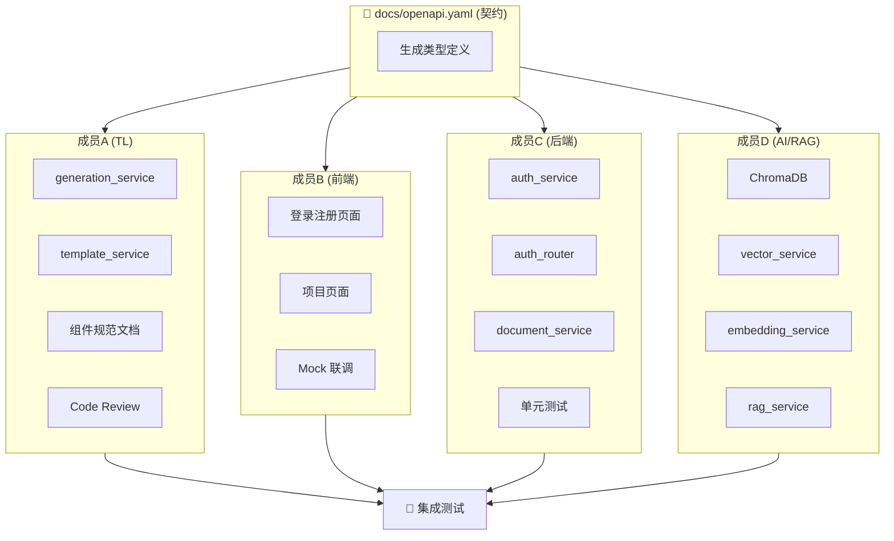
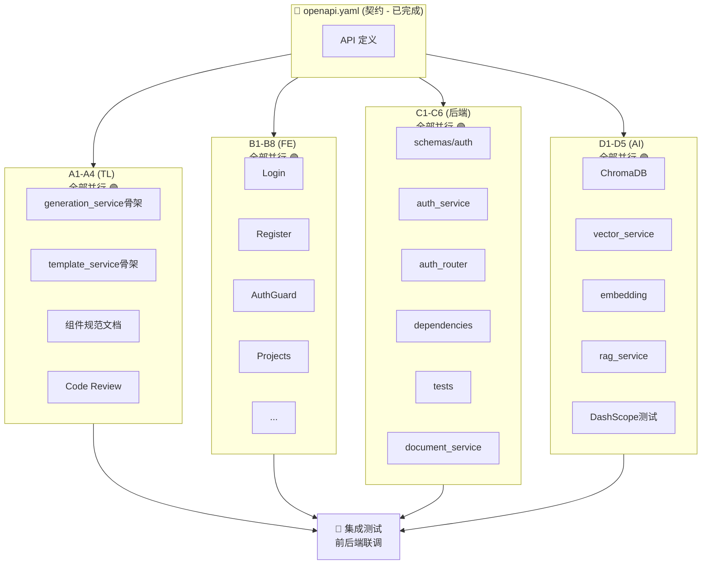

# Phase 1 任务看板 - 基础闭环

> 目标：实现最小可用系统，前后端认证打通
> 
> ⚡ **设计原则**：契约优先 (Contract-First) + 最大并行度
> - 所有人基于 `docs/openapi.yaml` 契约独立开发
> - 前端使用 Mock 数据开发，无需等待后端
> - 后端各模块独立，无交叉依赖
> - AI 模块完全独立，可并行推进

---

## 🔀 并行开发策略



### 🎯 关键：前端零阻塞开发

前端使用 **MSW (Mock Service Worker)** 或本地 Mock，基于 OpenAPI 契约模拟后端响应：

```typescript
// lib/api/mock.ts - 前端 Mock 数据
export const mockAuthResponse = {
  success: true,
  data: {
    user: { id: "mock-user-1", email: "test@test.com", username: "testuser" },
    access_token: "mock-jwt-token-xxx"
  }
};
```

---

## 📋 任务分配（零依赖设计）

### 🅰️ 成员 A (TL/架构师) - 可并行任务：4

| # | 任务 | 依赖 | 并行组 |
|---|------|------|--------|
| A1 | 创建 `services/generation_service.py` 骨架 | **无** | 🟢 |
| A2 | 创建 `services/template_service.py` 骨架 | **无** | 🟢 |
| A3 | 编写前端组件规范文档 `docs/standards/component-spec.md` | **无** | 🟢 |
| A4 | Code Review（异步进行） | 其他人提PR | 🔵 |

**A1-A2 骨架模板**（独立模块，不依赖其他服务）：
```python
# services/generation_service.py
from typing import Optional
from pydantic import BaseModel

class SlideContent(BaseModel):
    """单页幻灯片内容 - 由 AI 服务输出"""
    title: str
    bullet_points: list[str]
    notes: Optional[str] = None

class CoursewareContent(BaseModel):
    """课件内容结构 - A 与 D 的接口契约"""
    title: str
    slides: list[SlideContent]

class GenerationService:
    """课件生成服务 - 高内聚、低耦合"""
    
    async def generate_pptx(self, content: CoursewareContent) -> bytes:
        """生成 PPTX 文件（独立模块，可用 Mock 数据测试）"""
        # TODO: 使用 python-pptx 或 Marp
        pass
    
    async def generate_docx(self, content: CoursewareContent) -> bytes:
        """生成 Word 文档（独立模块）"""
        # TODO: 使用 python-docx 或 Pandoc
        pass
```
---

### 🅱️ 成员 B (前端主程) - 可并行任务：8（全部零依赖）

| # | 任务 | 依赖 | 并行组 | Mock 策略 |
|---|------|------|--------|-----------|
| B1 | Login 页面 + React Hook Form + Zod 验证 | **无** | 🟢 | Mock authService.login() |
| B2 | Register 页面 + 表单验证 | **无** | 🟢 | Mock authService.register() |
| B3 | `AuthGuard.tsx` 路由保护组件 | **无** | 🟢 | 检查 localStorage token |
| B4 | `app/projects/page.tsx` 项目列表页 | **无** | 🟢 | Mock 项目数据数组 |
| B5 | `app/projects/new/page.tsx` 新建项目页 | **无** | 🟢 | Mock create 响应 |
| B6 | `app/projects/[id]/page.tsx` 项目详情骨架 | **无** | 🟢 | Mock 单个项目 |
| B7 | 完善 `stores/authStore.ts` | **无** | 🟢 | 纯前端状态逻辑 |
| B8 | 完善 `stores/projectStore.ts`（新建） | **无** | 🟢 | 纯前端状态逻辑 |

**B1-B2 代码模板**（直接复制使用）：
```typescript
// 完全独立，不依赖后端
import { useForm } from "react-hook-form";
import { zodResolver } from "@hookform/resolvers/zod";
import { z } from "zod";

const loginSchema = z.object({
  email: z.string().email("请输入有效的邮箱"),
  password: z.string().min(6, "密码至少6位")
});

type LoginForm = z.infer<typeof loginSchema>;

// Mock 模式开发
const MOCK_MODE = process.env.NEXT_PUBLIC_MOCK === "true";

const handleSubmit = async (data: LoginForm) => {
  if (MOCK_MODE) {
    // 模拟成功响应
    return { user: { id: "1", email: data.email }, token: "mock-token" };
  }
  return await authApi.login(data);
};
```

---

### 🅲 成员 C (后端主程) - 可并行任务：6（全部零依赖）

| # | 任务 | 依赖 | 并行组 | 说明 |
|---|------|------|--------|------|
| C1 | `schemas/auth.py` - 请求/响应 Pydantic 模型 | **无** | 🟢 | 基于 openapi.yaml |
| C2 | `services/auth_service.py` - 完整认证服务 | **无** | 🟢 | create_user/verify/token |
| C3 | `routers/auth.py` - register/login/me 三接口 | **无** | � | 可先用 stub |
| C4 | `utils/dependencies.py` - get_current_user 依赖 | **无** | 🟢 | JWT 解析逻辑 |
| C5 | `tests/test_auth.py` - 认证单元测试 | **无** | 🟢 | Mock service |
| C6 | `services/document_service.py` - PDF/Word 解析骨架 | **无** | 🟢 | 从 D 分担 |

**C2 auth_service 模板**：
```python
# services/auth_service.py - C 负责完整实现
import bcrypt
import jwt
from datetime import datetime, timedelta

class AuthService:
    def __init__(self, secret_key: str = "your-secret"):
        self.secret_key = secret_key
    
    def hash_password(self, password: str) -> str:
        return bcrypt.hashpw(password.encode(), bcrypt.gensalt()).decode()
    
    def verify_password(self, password: str, hashed: str) -> bool:
        return bcrypt.checkpw(password.encode(), hashed.encode())
    
    def create_token(self, user_id: str) -> str:
        payload = {"sub": user_id, "exp": datetime.utcnow() + timedelta(hours=24)}
        return jwt.encode(payload, self.secret_key, algorithm="HS256")
    
    def verify_token(self, token: str) -> str | None:
        try:
            payload = jwt.decode(token, self.secret_key, algorithms=["HS256"])
            return payload.get("sub")
        except jwt.PyJWTError:
            return None
```

**C6 document_service 骨架**（从 D 分担）：
```python
# services/document_service.py - C 负责文档解析
from pathlib import Path

class DocumentService:
    """文档解析服务 - 从 D 分担，减轻 AI 模块压力"""
    
    async def extract_text_from_pdf(self, file_path: Path) -> str:
        """PDF 文本提取"""
        # TODO: 使用 PyMuPDF 或 pdfplumber
        pass
    
    async def extract_text_from_docx(self, file_path: Path) -> str:
        """Word 文本提取"""
        # TODO: 使用 python-docx
        pass
```

---

### 🅳 成员 D (AI工程师) - 可并行任务：5（精简后，全部零依赖）

| # | 任务 | 依赖 | 并行组 |
|---|------|------|--------|
| D1 | 安装 ChromaDB + 编写连接测试 | **无** | 🟢 |
| D2 | `services/vector_service.py` - 向量存储服务 | **无** | 🟢 |
| D3 | `services/embedding_service.py` - 文本向量化服务 | **无** | 🟢 |
| D4 | `services/rag_service.py` - RAG 检索骨架 | **无** | 🟢 |
| D5 | 测试 DashScope/Qwen API 调用 + Prompt 实验 | **无** | 🟢 |

**D 不再负责**（已分担）：
- ~~文档解析（PDF/Word）~~ → 成员 C
- ~~课件生成引擎~~ → 成员 A

**D2-D3 完全独立**，与其他模块无交互：
```python
# services/vector_service.py - 独立模块
import chromadb
from typing import List

class VectorService:
    """完全独立的向量服务，无外部依赖"""
    
    def __init__(self):
        self.client = chromadb.PersistentClient(path="./chroma_data")
        self.collection = self.client.get_or_create_collection(
            name="spectra_knowledge",
            metadata={"hnsw:space": "cosine"}
        )
    
    def add_documents(self, texts: List[str], ids: List[str], metadatas: List[dict] = None):
        self.collection.add(documents=texts, ids=ids, metadatas=metadatas)
    
    def search(self, query: str, top_k: int = 5) -> List[dict]:
        results = self.collection.query(query_texts=[query], n_results=top_k)
        return results
    
    # 可以独立测试，完全不需要其他模块
```

---

## 📊 并行度分析

### Phase 1 任务依赖图



### 统计

| 成员 | 总任务 | 可立即并行 | 需等待 | 并行率 |
|------|--------|-----------|--------|--------|
| A | 4 | 4 | 0 | **100%** |
| B | 8 | 8 | 0 | **100%** |
| C | 6 | 6 | 0 | **100%** |
| D | 5 | 5 | 0 | **100%** |
| **总计** | **23** | **23** | **0** | **100%** |

---

## ✅ 完成标准

Phase 1 完成时，以下场景必须可以运行：

```
1. 用户访问 /auth/register，填写表单，提交后账号创建成功
2. 用户访问 /auth/login，输入账号密码，登录成功跳转到 /projects
3. 已登录用户访问 /projects，可以看到项目列表（空列表）
4. 已登录用户点击"新建项目"，可以创建一个新项目
5. 未登录用户访问 /projects，自动跳转到 /auth/login
6. ChromaDB 可以在本地运行基础的向量存储和检索
7. generation_service 可以用 Mock 数据生成简单 PPT 骨架
```

---

## 🔧 AI 工具使用建议

### Cursor / Copilot 最佳实践

**给每个成员的 Prompt 模板**：

**成员 B (前端)**：
```
基于 docs/openapi.yaml 中的 API 契约，
为我生成 [组件名] 的完整实现，包括：
1. TypeScript 类型定义
2. React Hook Form + Zod 验证
3. Mock 数据用于开发测试
4. 错误处理和 loading 状态
```

**成员 C (后端)**：
```
基于 docs/openapi.yaml 中的 [API路径] 定义，
为我生成 FastAPI router 实现，包括：
1. Pydantic 请求/响应模型
2. 完整的错误处理
3. 日志记录
4. 单元测试
```

**成员 D (AI)**：
```
我正在实现一个 [服务名]，需要：
1. 使用 [库名] 实现 [功能]
2. 异步支持
3. 错误处理
4. 基础测试用例
请提供完整实现和使用示例。
```

---

## 📅 进度追踪

| 成员 | 已完成 | 进行中 | 阻塞 |
|------|--------|--------|------|
| A | - | - | - |
| B | - | - | - |
| C | - | - | - |
| D | - | - | - |

---

## 🆘 阻塞问题记录

| 日期 | 成员 | 问题描述 | 解决方案 | 状态 |
|------|------|---------|---------|------|
| - | - | - | - | - |

---

*最后更新: 2026-02-23*
