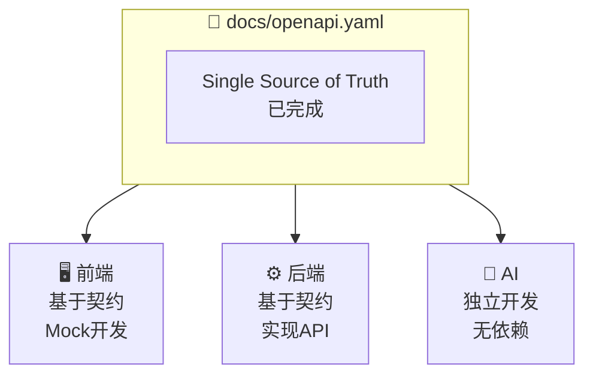
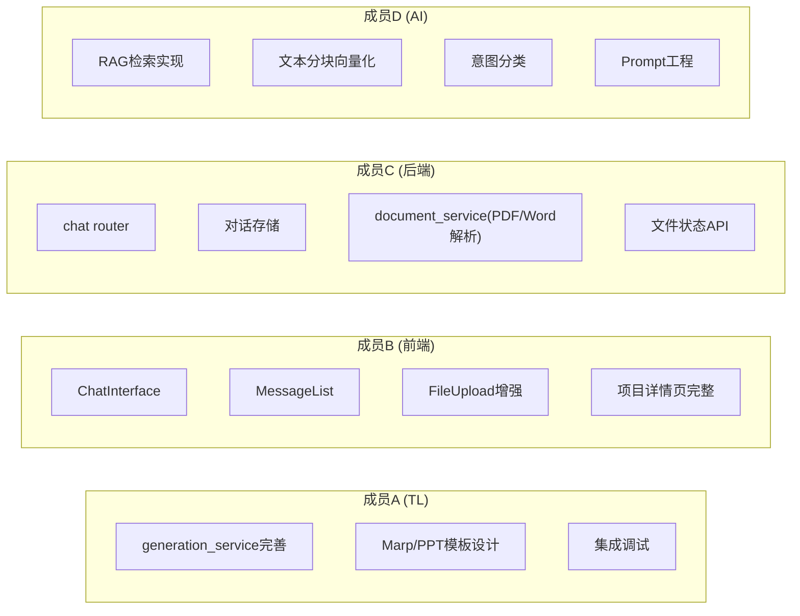
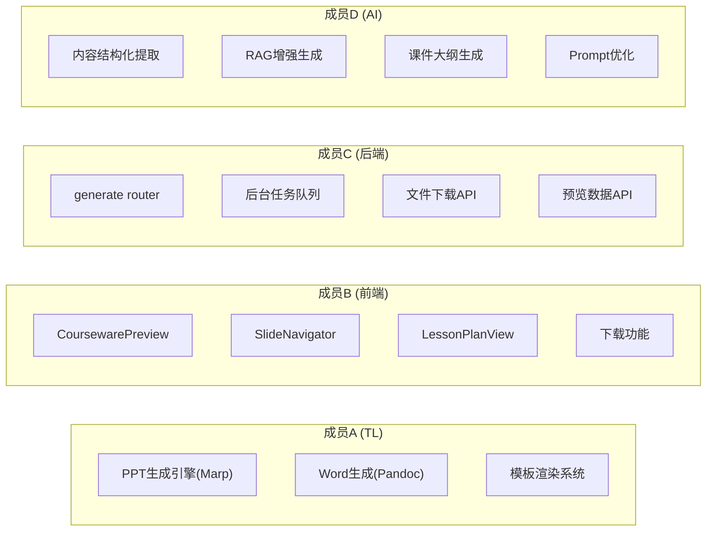
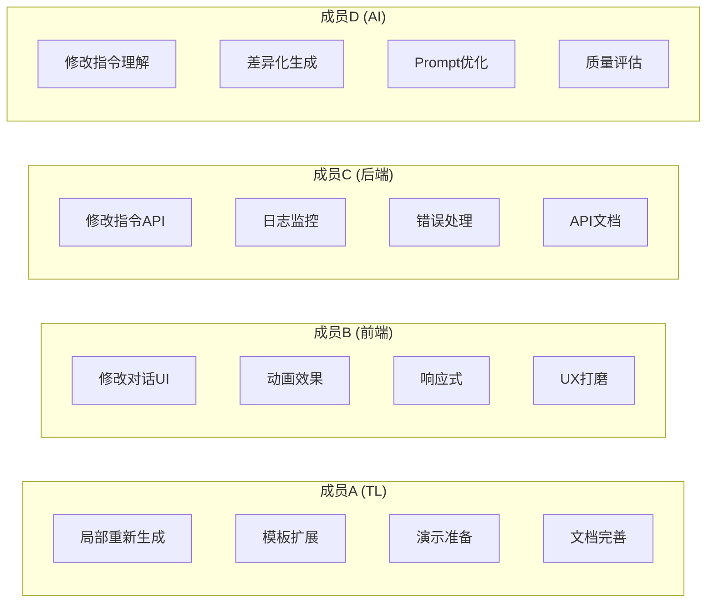

# Spectra 团队分工方案

> 四人全栈团队敏捷开发分工 | AI 辅助开发 | 大三软工学生团队

## 🎯 核心原则

### 契约优先 (Contract-First)



### 最大并行度设计
- **零阻塞**：每个成员的任务互不依赖
- **Mock 驱动**：前端使用 Mock 数据，不等后端
- **Stub 优先**：后端先写骨架，再填充实现
- **模块隔离**：AI 模块完全独立开发

### AI 辅助开发
- 每个模块配有 `.cursorrules` 
- 复杂实现让 AI 生成初版
- 人工 Review 确保质量

## 📋 项目现状总结

### 已完成的脚手架

| 模块 | 状态 | 说明 |
|------|------|------|
| **前端基础** | ✅ 完成 | Next.js 15 + TypeScript + Tailwind + Shadcn/ui 配置完成 |
| **UI 组件库** | ✅ 完成 | 28 个 Shadcn/ui 基础组件已安装 |
| **后端基础** | ✅ 完成 | FastAPI + Prisma ORM + 分层架构搭建完成 |
| **数据库模型** | ✅ 完成 | User/Project/Conversation/Upload/GenerationTask 等模型定义完成 |
| **API 契约** | ✅ 完成 | OpenAPI 1221 行完整定义（docs/openapi.yaml） |
| **认证框架** | 🔧 骨架 | auth router/service 有骨架，未实现逻辑 |
| **项目管理** | ✅ 可用 | projects/files router 已实现基础 CRUD |
| **对话系统** | 🔧 骨架 | chat router 返回 501 |
| **RAG 检索** | 🔧 骨架 | rag router 返回 501 |
| **课件生成** | 🔧 骨架 | generate/preview router 返回 501 |
| **AI 服务** | 🔧 骨架 | LiteLLM 集成，有 stub 响应 |
| **前端组件** | 🔧 部分 | Sidebar/SplitView/CourseOutline 等演示组件 |
| **前端页面** | 🔧 部分 | 登录/注册页面有 UI，未完整验证 |

### 待开发核心功能

1. **认证系统** - JWT 认证全流程
2. **对话系统** - 多轮对话、意图理解
3. **文件处理** - 多模态解析（PDF/Word/视频）
4. **RAG 检索** - 向量化存储、语义检索
5. **课件生成** - PPT/Word 生成引擎
6. **预览修改** - 可视化预览、对话式修改

---

## 👥 团队角色定义

### 成员 A - 架构师 / Tech Lead
**主要职责**：
- 架构设计与技术决策（已完成大部分）
- 任务分配与进度跟踪
- 代码审查与质量把控
- 外部沟通与汇报
- 前端交互设计（抽象层/组件规范，不写具体实现）
- **独立模块开发**：课件生成引擎（高内聚、与其他模块解耦）

**开发负责区域**：
```
backend/services/
├── generation_service.py   # 课件生成服务 ⭐ 主要开发
└── template_service.py     # 模板渲染服务 ⭐ 主要开发
```

**为什么分配课件生成模块给 A**：
- ✅ **高内聚**：输入是结构化数据，输出是文件，边界清晰
- ✅ **低耦合**：只依赖 AI 服务的输出，不依赖数据库/认证
- ✅ **可独立开发**：用 Mock 数据即可测试，不等其他模块
- ✅ **技术难度适中**：Marp/python-pptx 文档完善，AI 辅助容易

---

### 成员 B - 前端主程
**核心职责**：前端一致性负责人，把控所有前端代码风格、组件实现

**开发负责区域**：
```
frontend/
├── app/                    # 所有页面路由
├── components/             # 业务组件
├── lib/api/               # API 客户端
├── stores/                # 状态管理
└── hooks/                 # 自定义 Hooks
```

**具体任务**：
- 页面布局与路由实现
- 业务组件开发
- 状态管理（Zustand stores）
- API 调用封装
- 表单验证（React Hook Form + Zod）
- 响应式设计
- 动画效果（Framer Motion）

**前端一致性执行规则**：
1. 所有前端 PR 必须 B approve 才能 merge
2. 组件命名/文件结构遵循 `docs/standards/frontend.md`
3. A 负责抽象层设计（组件接口/数据流），B 负责具体实现

---

### 成员 C - 后端主程 / 数据流
**核心职责**：后端 API 实现、数据库操作、认证系统、**文档解析**

**开发负责区域**：
```
backend/
├── routers/
│   ├── auth.py            # 认证 API ⭐ 优先
│   ├── chat.py            # 对话 API
│   ├── projects.py        # 项目 API（已有基础）
│   └── files.py           # 文件 API（已有基础）
├── services/
│   ├── auth_service.py    # 认证服务 ⭐ 优先
│   ├── database.py        # 数据库服务（已有）
│   └── document_service.py # 文档解析 ⭐ 从D分担
└── schemas/               # Pydantic 模型
```

**具体任务**：
- 实现认证系统（JWT 生成/验证）
- 完善项目 CRUD API
- 实现对话存储与检索
- 文件上传与元数据管理
- **文档解析服务**（PDF/Word 文本提取）← 从成员 D 分担

**为什么把文档解析给 C**：
- ✅ 文档解析本质是"文件处理"，与 C 负责的 files 模块强相关
- ✅ 技术栈（Python 文件处理）与后端一致
- ✅ 减轻 D 的 AI 专项压力

---

### 成员 D - AI/RAG 工程师
**核心职责**：AI 核心能力、RAG 检索、Prompt 工程（专注 AI 相关）

**开发负责区域**：
```
backend/
├── routers/
│   ├── rag.py             # RAG 检索 API
│   └── preview.py         # 预览修改 API
├── services/
│   ├── ai.py              # AI 服务（已有基础）
│   ├── rag_service.py     # RAG 服务（新建）
│   ├── vector_service.py  # 向量存储（新建）
│   └── embedding_service.py # 向量化服务（新建）
```

**具体任务**（精简后）：
- ChromaDB 向量数据库集成
- 文本向量化与存储
- RAG 语义检索
- Prompt 工程与优化
- 意图理解与分类

**不再负责**（已分担）：
- ~~文档解析（PDF/Word）~~ → 成员 C
- ~~PPT/Word 生成引擎~~ → 成员 A

---

## 📊 开发阶段规划（高并行版）

### 🚀 Phase 1：基础闭环

**并行度：100%（23个任务，全部可并行）**

```mermaid
gantt
    title Phase 1 并行任务流
    dateFormat X
    axisFormat %s
    
    section 成员A (TL)
    generation_service骨架  :a1, 0, 1
    template_service骨架    :a2, 0, 1
    前端组件规范文档        :a3, 0, 1
    Code Review            :a4, 0, 1
    
    section 成员B (前端)
    Login页          :b1, 0, 1
    Register页       :b2, 0, 1
    AuthGuard        :b3, 0, 1
    项目列表         :b4, 0, 1
    新建项目         :b5, 0, 1
    详情骨架         :b6, 0, 1
    stores完善       :b7, 0, 1
    
    section 成员C (后端)
    schemas/auth     :c1, 0, 1
    auth_service     :c2, 0, 1
    auth_router      :c3, 0, 1
    dependencies     :c4, 0, 1
    document_service :c5, 0, 1
    单元测试         :c6, 0, 1
    
    section 成员D (AI)
    ChromaDB         :d1, 0, 1
    vector_service   :d2, 0, 1
    embedding_service :d3, 0, 1
    rag_service骨架  :d4, 0, 1
    DashScope测试    :d5, 0, 1
    
    section 集成
    集成联调         :int, 1, 2
```



**详见**: [Phase 1 任务看板](./PHASE1_TASKS.md)

---

### 📝 Phase 2：对话与文件（高并行设计）

**目标**：实现核心对话功能和文件处理



| 成员 | 任务数 | 可并行 | 依赖其他成员 |
|------|--------|--------|-------------|
| A | 3 | 3 | 无（独立模块） |
| B | 4 | 4 | 无（使用Mock） |
| C | 4 | 4 | 无 |
| D | 4 | 4 | 无 |

---

### 🎨 Phase 3：课件生成（高并行设计）

**目标**：实现 PPT/Word 生成与预览



| 成员 | 任务数 | 可并行 | 依赖其他成员 |
|------|--------|--------|-------------|
| A | 3 | 3 | D提供结构化内容 → A生成文件 |
| B | 4 | 4 | 无（使用Mock） |
| C | 4 | 4 | 无 |
| D | 4 | 4 | 无 |

**A 与 D 的接口约定**：
```python
# D 输出 → A 输入
class CoursewareContent:
    title: str
    slides: list[SlideContent]  # D 负责生成
    lesson_plan: LessonPlanContent  # D 负责生成

# A 负责将 CoursewareContent 渲染为 .pptx / .docx
```

---

### 🔄 Phase 4：迭代优化

**目标**：实现对话式修改、体验优化



---

## 📁 文件所有权矩阵

| 路径 | 主要负责人 | 协作者 |
|------|-----------|--------|
| `frontend/app/` | B | A（抽象设计） |
| `frontend/components/` | B | A（接口规范） |
| `frontend/lib/api/` | B | C（契约对齐） |
| `frontend/stores/` | B | - |
| `backend/routers/auth.py` | C | - |
| `backend/routers/chat.py` | C | D（AI集成） |
| `backend/routers/projects.py` | C | - |
| `backend/routers/files.py` | C | - |
| `backend/routers/rag.py` | D | C（数据层） |
| `backend/routers/generate.py` | A | D（AI调用） |
| `backend/routers/preview.py` | D | A（生成集成） |
| `backend/services/auth_service.py` | C | - |
| `backend/services/ai.py` | D | - |
| `backend/services/database.py` | C | - |
| `backend/services/document_service.py` | C | D（向量化对接） |
| `backend/services/rag_service.py` | D | - |
| `backend/services/vector_service.py` | D | - |
| `backend/services/generation_service.py` | **A** | D（内容输入） |
| `backend/services/template_service.py` | **A** | - |
| `docs/` | A | 全员 |
| `prisma/schema.prisma` | C | A（Review） |

---

## 🔧 协作规范

### Git 工作流（支持并行）
```bash
main                        # 稳定版本
├── develop                 # 开发主分支
    ├── feat/auth-frontend  # 成员 B - 前端认证
    ├── feat/project-pages  # 成员 B - 项目页面
    ├── feat/auth-backend   # 成员 C - 后端认证
    ├── feat/auth-service   # 成员 A - 认证服务
    ├── feat/rag-service    # 成员 D - RAG 服务
    └── feat/vector-db      # 成员 D - 向量数据库
```

**多分支并行**：每个成员可以同时有多个 feature 分支，互不干扰。

### 契约优先工作流
```bash
# 1. 所有人基于同一份契约
cat docs/openapi.yaml

# 2. 前端生成 TypeScript 类型（可选）
cd frontend && npx openapi-typescript ../docs/openapi.yaml -o lib/types/api.d.ts

# 3. 后端生成 Pydantic 模型（可选）
cd backend && datamodel-codegen --input ../docs/openapi.yaml --output schemas/generated.py

# 4. 各自独立开发，最后集成
```

### Mock 驱动开发（前端零阻塞）

```typescript
// frontend/.env.local
NEXT_PUBLIC_API_MOCK=true  // 开发时使用 Mock

// lib/api/client.ts
const useMock = process.env.NEXT_PUBLIC_API_MOCK === 'true';

export async function request<T>(path: string, options?: RequestOptions): Promise<T> {
  if (useMock) {
    return getMockResponse(path, options);  // 返回 Mock 数据
  }
  return await fetch(getApiUrl(path), options);
}
```

### Stub 驱动开发（后端模块解耦）

```python
# routers/auth.py - 先写完整 router，service 用 stub
@router.post("/login")
async def login(request: LoginRequest):
    # Phase 1: 使用 stub
    user = await auth_service.login(request.email, request.password)
    # auth_service.login 内部可以先返回 mock 数据
    return success_response(data={"user": user, "access_token": "..."})
```

### Code Review 原则（异步 Review）
- 每个 PR 至少 1 人 review
- **不阻塞开发**：review 可异步进行
- 前端改动 → B 必须 approve
- 核心服务改动 → A 必须 approve
- **小 PR 优先**：一个功能一个 PR，便于快速 merge

---

## 📌 立即行动清单

### 成员 A（TL）今天要做：
1. [ ] 召开 Kickoff 会议，分享此文档
2. [ ] 确认每个成员理解自己的职责范围
3. [ ] 创建 `feat/generation-service` 分支
4. [ ] 开始搭建 `generation_service.py` 骨架

### 成员 B（前端）今天要做：
1. [ ] 阅读 `docs/architecture/frontend/` 全部文档
2. [ ] 运行 `npm run dev`，熟悉现有代码
3. [ ] 创建 `feat/frontend-pages` 分支
4. [ ] 开始改造 Login 页面表单验证

### 成员 C（后端）今天要做：
1. [ ] 阅读 `docs/architecture/backend/` 全部文档
2. [ ] 阅读 `docs/openapi.yaml` 中 Auth 部分
3. [ ] 创建 `feat/auth-system` 分支
4. [ ] 开始实现 `auth_service.py` 完整逻辑

### 成员 D（AI）今天要做：
1. [ ] 阅读 `docs/decisions/004-llm-selection.md`
2. [ ] 阅读 `docs/decisions/006-vector-database.md`
3. [ ] 本地安装 ChromaDB：`pip install chromadb`
4. [ ] 创建 `feat/rag-service` 分支

---

## 📞 沟通矩阵

| 问题类型         | 首先找谁     |
| ------------ | -------- |
| 前端 UI/组件设计   | 成员 B     |
| API 契约疑问     | 成员 A 或 C |
| 数据库模型问题      | 成员 C     |
| AI/Prompt 相关 | 成员 D     |
| 架构/技术决策      | 成员 A     |
| Git 冲突处理     | 成员 A     |

---

## 🎯 成功标准

### MVP 完成标准
- [ ] 用户可以注册登录
- [ ] 可以创建项目、上传文件
- [ ] 可以进行多轮对话描述需求
- [ ] 可以生成 PPT 和 Word 教案
- [ ] 可以预览和下载生成的课件
- [ ] 可以通过对话修改课件

### 演示视频要点
1. 展示自然语言对话交互
2. 展示多模态文件处理（PDF + 视频）
3. 展示课件生成过程
4. 展示迭代修改流程
5. 展示最终导出效果

---

*文档版本: v1.0 | 创建日期: 2026-02-23 | 作者: TL (成员 A)*
