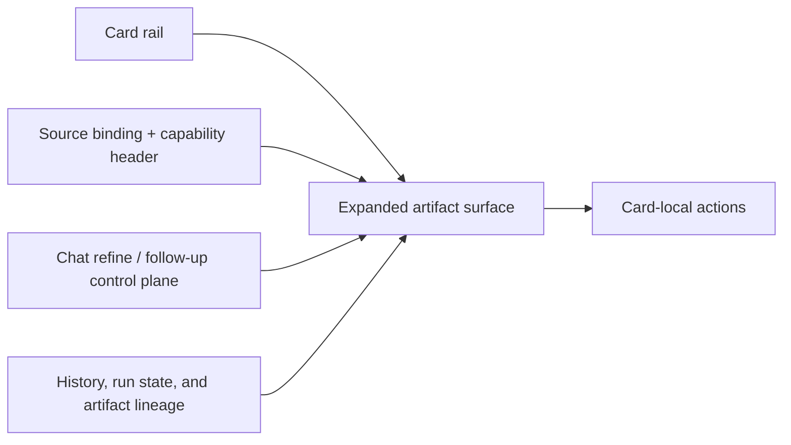

# Studio Interaction Architecture

> Status: `active design`
> Updated: `2026-04-17`
> Purpose: define the shared Studio working-surface model before multi-card parallel implementation.

## 1. Why this exists

Studio should no longer be treated as a pile of card-specific forms.

Current live code already proves that Studio has:

- a backend card catalog and execution plan surface
  - [backend/services/generation_session_service/card_catalog.py](../../../backend/services/generation_session_service/card_catalog.py)
  - [backend/services/generation_session_service/card_execution_preview.py](../../../backend/services/generation_session_service/card_execution_preview.py)
- a frontend card SDK and panel implementation
  - [frontend/lib/sdk/studio-cards.ts](../../../frontend/lib/sdk/studio-cards.ts)
  - [frontend/components/project/features/studio/](../../../frontend/components/project/features/studio/)

The next step is not adding more bespoke UI branches. It is fixing the interaction skeleton so each card grows on the same product grammar.

## 2. External reference baseline

This document adopts the following references as direct design inputs:

- [Anthropic Artifacts](https://www.anthropic.com/news/artifacts)
  - use as the baseline for "conversation controls a separate work surface"
- [Anthropic help: What are Artifacts](https://support.anthropic.com/en/articles/9487310-what-are-artifacts-and-how-do-i-use-them)
  - use for the dedicated work-window mental model
- [Vercel AI SDK](https://vercel.com/docs/ai-sdk)
  - use for structured output and generated UI thinking, not for provider lock-in
- [XState](https://stately.ai/docs/xstate)
  - use for formal workflow/state modeling of complex card flows
- [Tiptap Collaboration overview](https://tiptap.dev/docs/collaboration/getting-started/overview)
  - use for document-style artifact surfaces and collaboration/version thinking
- [Markmap docs](https://markmap.js.org/docs/markmap)
  - use for reading-first mindmap surfaces
- [React Flow](https://reactflow.dev/)
  - use for editable node-graph surfaces when node-level operations become primary
- [Remotion](https://www.remotion.dev/)
  - use as a serious candidate for structured animation output, not as an immediate mandatory dependency

## 3. Current runtime facts that this design must respect

- `studio-cards` is the current shared contract surface, not a speculative future API.
- `courseware_ppt` remains the main production chain and should not be flattened into "just another card".
- The non-PPT cards already exist in the catalog as first-class capabilities:
  - `word_document`
  - `interactive_quick_quiz`
  - `interactive_games`
  - `knowledge_mindmap`
  - `demonstration_animations`
  - `speaker_notes`
  - `classroom_qa_simulator`
- Live code currently marks all seven non-PPT cards above as `foundation_ready`.
- Older prose such as [docs/studio-card-backend-protocol.md](../../studio-card-backend-protocol.md) is still useful, but live code wins when there is drift.

## 4. Core product decisions

### 4.1 Studio is a workbench, not a form wizard

The default Studio interaction should be:

- choose or reopen a card
- enter an artifact work surface
- configure only what is needed to act
- generate or continue
- inspect, refine, and branch from the current artifact/session state

Configuration is a prelude, not the main event.

### 4.2 Cards are artifact surfaces

Each card should render as a durable working surface around a real result:

- a document
- a teleprompter-like script
- a graph
- a single-question viewer
- a simulation transcript
- a sandbox artifact
- an animation/media artifact

The user should feel they are working on a result, not filling out an integration screen.

### 4.3 Chat is a control plane

Chat should not compete with the card surface as a sibling page.

Chat exists to:

- initiate work
- issue refine requests
- explain system state
- carry selection-aware instructions
- continue a loop when the card supports conversation-like iteration

The main artifact stays visually primary.

## 5. Shared Studio frame

All non-PPT cards should converge on the following shared frame:

### 5.1 Required regions

- `Card rail`
  - shows available capabilities and maturity
- `Capability header`
  - shows title, readiness, source requirements, refine support, and primary action
- `Source binding strip`
  - visible whenever a card depends on prior artifacts or explicit sources
- `Artifact surface`
  - the main reading/editing/interacting pane
- `Card-local action band`
  - execute, regenerate, continue, refine, export, download
- `Control-plane entry`
  - chat refine, structured refine, or follow-up turn entry
- `Lineage/history region`
  - session state, artifact replacements, and last runnable state

### 5.2 Never hide these under card-specific whim

- source requirement
- readiness state
- current execution status
- whether refine is available
- whether the current surface is session-backed, artifact-backed, or hybrid

## 6. Target interaction vocabulary

These types are the target internal interaction grammar for later implementation:

- `ArtifactSurfaceType = document | teleprompter | graph | flashcard | simulator | sandbox | animation`
- `CapabilityEngine = rich_text | node_graph | single_item | simulation_loop | sandbox_html | media_timeline`
- `RefineMode = chat_refine | structured_refine | follow_up_turn`
- `SelectionScope = none | page | paragraph | node | question | scene`
- `ExecutionCarrier = session | artifact | hybrid`

The frontend may continue using `ToolFlowContext` temporarily, but future growth should land in these dimensions instead of adding ad hoc booleans.

## 7. Card taxonomy

### 7.1 Main production chain

- `courseware_ppt`
  - special status: the primary generation chain, not a generic derivative card

### 7.2 Document-like surfaces

- `word_document`
- `speaker_notes`

### 7.3 Single-result reading surfaces

- `interactive_quick_quiz`
- `knowledge_mindmap`

### 7.4 Interactive loop surfaces

- `classroom_qa_simulator`

### 7.5 Sandbox/media surfaces

- `interactive_games`
- `demonstration_animations`

## 8. State-machine rule

Cards with more than one meaningful phase must be modeled as explicit state machines.

Minimum formal phases:

- `idle`
- `missing_requirements`
- `ready_to_execute`
- `executing`
- `result_available`
- `refining`
- `continuing`
- `failed`

Card-local UI state may exist, but the product flow itself should not be encoded as scattered booleans and implicit component branches.

`XState` is the preferred wheel for the formal workflow layer. If a lighter wrapper is used early, it must preserve the same state vocabulary and event model so migration is cheap.

## 9. Shared rules by interaction type

### 9.1 Source binding

- source requirements must be visible before execution
- invalid or missing source bindings must block execution explicitly
- source identity must stay visible after execution
- multi-source is allowed only when the contract explicitly supports it

### 9.2 Refine

Three modes must remain distinct:

- `chat_refine`
  - freeform instruction against the current artifact/session context
- `structured_refine`
  - card-specific targeted update against a selected anchor or structured field
- `follow_up_turn`
  - continuation of a loop that changes the next interaction state, especially in simulation

### 9.3 Selection context

Selections should become first-class only where the surface truly supports them:

- `paragraph` for document and teleprompter surfaces
- `node` for mindmap/node graph
- `question` for quiz
- `scene` for animation
- `page` for PPT-adjacent or page-derived surfaces

## 10. Non-goals

- Do not build a universal visual editor before the contracts are stable.
- Do not force every card into live collaborative editing immediately.
- Do not treat `interactive_games` or `demonstration_animations` as front-end polish problems; they are engine and contract problems first.

## 11. Immediate implementation order after this research phase

1. `speaker_notes`
   - copy the mature `word_document` pattern and become the second stable document-derived sample
2. `interactive_quick_quiz`
   - turn artifact output into a real single-question surface
3. `knowledge_mindmap`
   - make selection-aware structured refine a first-class pattern
4. `classroom_qa_simulator`
   - formalize the continuation loop as a real working surface
5. `interactive_games` and `demonstration_animations`
   - only after engine and contract decisions are stable
