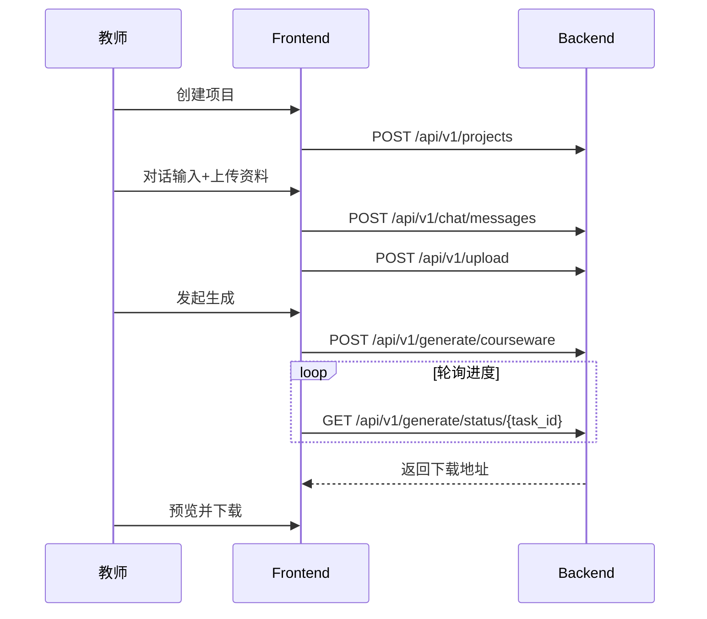

# API规划

## 目标
给出前后端接口清单与优先级，支撑“输入-生成-修改-导出”闭环。  
详细字段定义以 `docs/openapi.yaml` 为准，本文仅做功能级规划。

## 规划原则
- 契约优先：先更新 `docs/openapi.yaml`，再实现接口。
- 统一响应：保持 `success/data/message` 结构。
- 异步优先：解析与生成走任务机制，避免长请求阻塞。
- 渐进扩展：P0 保闭环，P1/P2 通过新增接口扩展能力。

## P0 接口清单（MVP）
| 编号 | 方法 | 路径 | 作用 | 对应功能 | 状态 |
|---|---|---|---|---|---|
| A01 | POST | `/api/v1/projects` | 创建课件项目 | F01 | 已在契约 |
| A02 | GET | `/api/v1/projects` | 获取项目列表 | F01 | 已在契约 |
| A03 | GET | `/api/v1/projects/{project_id}` | 获取项目详情 | F01 | 已在契约 |
| A04 | POST | `/api/v1/chat/messages` | 提交用户输入并获取 AI 回复 | F02/F03 | 已在契约 |
| A05 | GET | `/api/v1/chat/messages` | 查询项目对话历史 | F02 | 已在契约 |
| A06 | POST | `/api/v1/upload` | 上传参考资料 | F04 | 已在契约 |
| A07 | GET | `/api/v1/upload/{project_id}` | 获取资料列表与解析状态 | F04/F05/F06 | 已在契约 |
| A08 | POST | `/api/v1/generate/courseware` | 创建课件/教案生成任务 | F08/F09/F10 | 已在契约 |
| A09 | GET | `/api/v1/generate/status/{task_id}` | 查询生成进度与结果地址 | F11/F12 | 已在契约 |

## P1 接口清单（增强）
> 以下为需求清单已提出、但尚未进入 `openapi.yaml` 的待补充接口。

| 编号 | 方法 | 路径（建议） | 作用 | 对应功能 | 状态 |
|---|---|---|---|---|---|
| B01 | GET | `/api/v1/upload/{project_id}/{file_id}/segments` | 获取解析片段（页段/时间段/关键帧） | F05/F06 | 待补充契约 |
| B02 | POST | `/api/v1/rag/query` | 按学段/学科/章节检索知识库片段 | F07 | 待补充契约 |
| B03 | POST | `/api/v1/rag/feedback` | 记录片段采纳/忽略/置顶反馈 | F13 | 待补充契约 |
| B04 | POST | `/api/v1/generate/revise` | 基于修改指令触发再生成 | F11 | 待补充契约 |
| B05 | POST | `/api/v1/voice/transcribe` | 语音转写与术语纠错 | F03 | 待补充契约 |
| B06 | GET | `/api/v1/generate/result/{task_id}/trace` | 查询页级来源溯源信息 | F13 | 待补充契约 |

## P2 接口清单（迭代）
| 编号 | 方法 | 路径（建议） | 作用 | 对应功能 | 状态 |
|---|---|---|---|---|---|
| C01 | GET | `/api/v1/projects/{project_id}/versions` | 获取版本历史 | F17 | 待补充契约 |
| C02 | POST | `/api/v1/projects/{project_id}/versions/{version_id}/restore` | 版本回滚 | F17 | 待补充契约 |
| C03 | GET | `/api/v1/templates` | 获取模板列表 | F18 | 待补充契约 |
| C04 | POST | `/api/v1/templates` | 保存当前项目为模板 | F18 | 待补充契约 |
| C05 | POST | `/api/v1/projects/{project_id}/share` | 生成分享链接/协作入口 | F19 | 待补充契约 |

## 阶段规划
| 阶段 | 目标 | 主要接口 |
|---|---|---|
| 阶段1（MVP） | 跑通核心闭环 | A01-A09 |
| 阶段2（增强） | 提升可控性与可追溯性 | B01-B06 |
| 阶段3（迭代） | 强化复用与协作能力 | C01-C05 |

## 调用主流程

