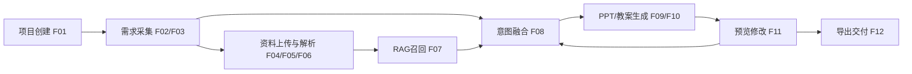

# 功能需求清单

## 参考依据
- 项目原始需求：`docs/project/requirements.md`
- 技术可行性：`docs/decisions/` (ADR 001-008)
- 用户场景：`docs/requirements/ux/user-scenarios.md`
- AI 能力定义：`docs/requirements/ai/1.capabilities.md`
- **需求对齐矩阵**：`docs/requirements/alignment-matrix.md`

## 功能清单（按优先级）

| 编号 | 功能模块 | 核心需求 | 输入 | 输出 | AI能力 | 优先级 |
|---|---|---|---|---|---|---|
| F01 | 项目创建与基础信息 | 创建课件项目，记录学段/学科/课时/目标 | 项目名称、学段、学科、课时 | 项目记录、初始上下文 | - | P0 |
| F02 | 多轮对话需求采集 | AI 主动追问并确认教学意图、重点难点、互动方式 | 文本输入 | 结构化需求草案 | C1 | P0 |
| F03 | 语音输入与术语纠错 | 支持语音输入，识别后按学科术语纠错 | 语音流 | 转写文本、纠错提示 | C1 | P0 |
| F04 | 多格式资料上传 | 支持 PDF/Word/PPT/图片/视频上传并绑定项目 | 本地文件 | 可解析的资料集合 | - | P0 |
| F05 | 文档结构化解析 | 提取文档标题、段落、题目、图表等内容 | PDF/Word/PPT | 可引用的结构化片段 | C2 | P0 |
| F06 | 视频关键帧与片段提取 | 提取关键帧、分段并供用户勾选用途 | 视频文件 | 时间轴片段、关键帧清单 | C2 | P0 |
| F07 | 本地知识库 RAG | 资料入库、向量检索、生成时召回并可追溯 | 本地知识资料、检索条件 | 命中片段、来源信息 | C2 | P0 |
| F08 | 教学意图融合引擎 | 融合对话意图+参考资料+RAG，生成课件指令集 | F02/F05/F06/F07 输出 | 可执行生成指令集 | C1+C2+C3 | P0 |
| F09 | PPT 课件生成 | 生成封面/目录/内容/总结等完整 PPT | 指令集、风格参数 | `.pptx` 课件草稿 | C4 | P0 |
| F10 | Word 教案生成 | 生成与 PPT 配套教案（目标、流程、活动、作业） | 指令集、教学模板 | `.docx` 教案草稿 | C4 | P0 |
| F11 | 预览与所见即改 | 支持逐页预览、对话式修改、局部重生成 | 用户修改指令、页级上下文 | 更新后的页面或课件版本 | C5 | P0 |
| F12 | 导出与交付 | 导出 `.pptx`、`.docx`，动画/互动至少一种集成方式 | 最终版本、导出选项 | 下载包（PPT/Word/HTML5/GIF/MP4之一） | C4 | P0 |
| F13 | 来源溯源与引用说明 | 展示内容来源（文件名/页码/片段），支持采纳/忽略 | 生成结果、检索命中 | 可追溯标注、反馈记录 | C2 | P1 |
| F14 | 教学法与结构建议 | 提供教学法推荐、时长冲突提示、结构精简建议 | 课时、知识点密度、教学目标 | 调整建议与可选方案 | C3 | P1 |
| F15 | 学段与学情适配 | 按小学/初中/高中及学情自动调整难度与表达 | 学段、学情模式 | 适配后的内容策略 | C3 | P1 |
| F16 | 互动内容增强 | 自动生成选择题/填空/简易互动小游戏 | 知识点、题目素材 | 互动页或互动资源 | C4 | P1 |
| F17 | 历史项目与版本管理 | 保存对话与生成版本，支持回滚与再编辑 | 项目历史、版本标签 | 可追踪版本链 | C5 | P2 |
| F18 | 模板库与风格复用 | 保存课件风格与结构模板并复用 | 课件模板、风格配置 | 模板化生成参数 | - | P2 |
| F19 | 分享与协作（轻量） | 支持链接分享或协作批注（非实时） | 项目权限、分享设置 | 分享链接、协作记录 | - | P2 |

### AI 能力编号说明
- **C1**: 多模态意图深度解析
- **C2**: 非结构化资料的结构化重构
- **C3**: 遵循教育心理学的教研规划
- **C4**: 内容多端协同生成
- **C5**: 增量式对话优化与记忆

## MVP 范围（建议）
- 必做（首版可演示闭环）：F01-F12
- 增强（有时间再做）：F13-F16
- 加分（迭代能力）：F17-F19

## 功能关系

## 可行性约束（基于 ADR）
- 前端采用 Next.js 15：支持流式状态反馈与预览交互，适配 F11。
- 后端采用 FastAPI：适合异步任务编排（解析、检索、生成），支撑 F05-F10。
- 数据库初期 SQLite：优先承载项目/对话/版本元数据；高并发与大规模检索后续迁移扩展。
