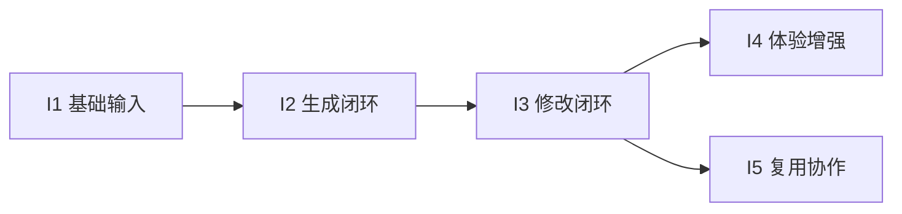

# 迭代规划

## 规划目标
在可演示周期内优先完成 P0 闭环（输入-生成-修改-导出），再迭代 P1/P2 增强能力。  
规划依据：`feature-list.md`、`system-boundary.md`、`api-planning.md`。

## 迭代总览
| 迭代 | 目标 | 功能范围 | 接口范围 |
|---|---|---|---|
| I1 基础输入 | 跑通项目、对话、上传基础链路 | F01-F06 | A01-A07 |
| I2 生成闭环 | 接入 RAG 与生成任务，产出可下载文件 | F07-F10、F12 | A08-A09 + 内部任务编排 |
| I3 修改闭环 | 建立预览修改与再生成循环 | F11 + F13（文件级溯源） | A04/A09 + B04/B06（先最小实现） |
| I4 体验增强 | 强化教学适配与内容质量 | F14-F16 | B01-B05 |
| I5 复用协作 | 补齐版本、模板、分享能力 | F17-F19 | C01-C05 |

## 详细计划

### I1 基础输入（MVP-1）
1. 目标
- 形成“创建项目 -> 对话输入 -> 上传资料 -> 查看状态”的可用链路。

2. 交付物
- 项目与会话管理页面（最小可用）
- 文件上传与列表接口可用
- 至少支持 PDF、视频两类资料进入解析队列

3. 验收标准
- 能创建项目并保存对话历史
- 上传后可看到文件状态（uploading/parsing/ready/failed）
- 单次演示中可稳定完成 1 个项目从输入到资料就绪

### I2 生成闭环（MVP-2）
1. 目标
- 形成“意图融合 -> 生成任务 -> 轮询进度 -> 导出下载”链路。

2. 交付物
- 生成任务创建与状态查询
- 课件 `.pptx` 与教案 `.docx` 产出
- 本地知识库检索增强最小可用流程

3. 验收标准
- 能从同一项目生成 PPT 与 Word（二选一或同时）
- 生成任务可返回进度与结果地址
- 至少 1 个场景可演示“资料+对话+RAG”联合生成

### I3 修改闭环（MVP-3）
1. 目标
- 支持“预览 -> 提修改 -> 再生成”的迭代能力。

2. 交付物
- 修改指令接入（页级或整体级）
- 再生成任务触发能力
- 文件级来源溯源（命中文件名/来源标识）

3. 验收标准
- 用户可对已有结果提出修改并得到新版本
- 至少支持 3 类修改（顺序、文案简化、案例新增）
- 结果可查看来源信息（至少文件级）

### I4 体验增强（P1）
1. 目标
- 提升教学场景适配度与可控性，减少人工返工。

2. 交付物
- 教学法建议与时长冲突提示
- 学段/学情适配策略
- 语音转写与术语纠错
- 解析片段可选用与反馈机制（采纳/忽略）

3. 验收标准
- 同一主题可输出至少 2 种教学风格差异化结果
- 语音输入可稳定转写并完成术语修正
- 可对检索/解析片段进行显式反馈

### I5 复用协作（P2）
1. 目标
- 构建可持续复用能力，提升长期使用效率。

2. 交付物
- 版本历史与回滚
- 模板保存与复用
- 分享链接（轻量协作）

3. 验收标准
- 任一项目可回滚到指定历史版本
- 模板可复用到新项目并成功生成
- 分享链接可受控访问（最小权限）

## 依赖关系
1. I1 是 I2 前置：没有项目/上传链路，生成无法落地。  
2. I2 是 I3 前置：没有可生成结果，无法进行“修改再生成”。  
3. I3 是 I4 前置：体验优化需要建立在稳定闭环上。  
4. I5 可部分并行，但建议在 I3 后启动以降低返工。  

## 风险与应对
| 风险 | 影响 | 应对策略 |
|---|---|---|
| 多模态解析耗时不稳定 | 影响生成体验 | 采用异步任务+进度反馈，先保可用再做性能优化 |
| 生成质量波动 | 增加修改成本 | 建立提示词模板与最小质量检查（结构/页数/术语） |
| SQLite 并发瓶颈 | 高并发下延迟上升 | 在 I4-I5 预留 PostgreSQL 迁移窗口 |
| 接口频繁变更 | 前后端协作成本高 | 坚持 Contract-First，变更先改 `openapi.yaml` |

## 里程碑退出条件
- M1（I1 完成）：输入链路稳定，可上传并查看解析状态。
- M2（I2 完成）：可生成并下载 `.pptx/.docx`。
- M3（I3 完成）：可修改并再生成，形成完整闭环。
