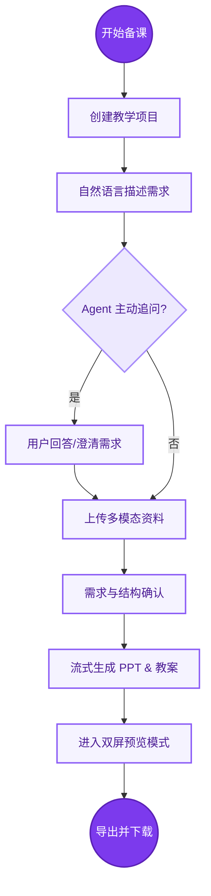
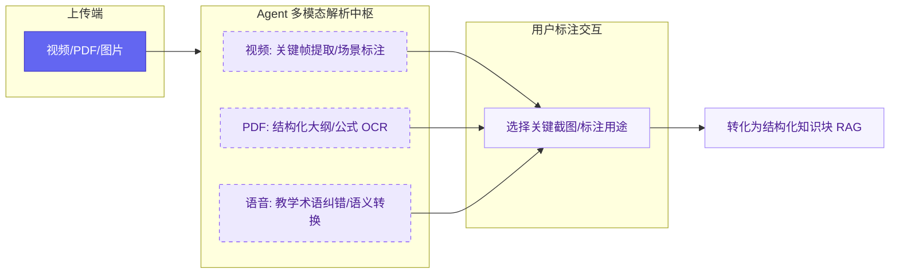
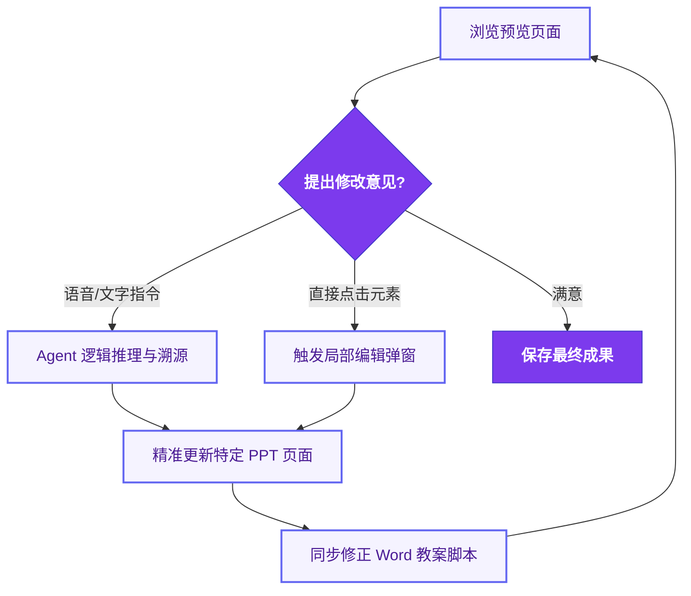

# 交互设计

## 核心交互流程

### 流程图

#### 1.全局任务主流程图



#### 2.多模态深度解析流程图




#### 3.闭环迭代修改流程图 




### 1. 对话交互流程

```
用户进入 → 创建项目 → 描述需求 → AI提问 → 用户回答 → 确认需求 → 生成课件
                ↓
            上传资料（可选）
                ↓
            标注用途
```

#### 1.1 文字输入交互

**界面布局**：

```
┌─────────────────────────────────────────┐
│  Spectra - 课件助手                      │
├─────────────────────────────────────────┤
│                                         │
│  [AI头像] 您好！我是您的课件助手         │
│           请告诉我这节课的教学目标       │
│                                         │
│  [用户头像] 我要教五年级数学分数加减法   │
│                                         │
│  [AI头像] 好的！请问：                   │
│           1. 这节课计划多长时间？        │
│           2. 学生之前学过分数吗？        │
│                                         │
├─────────────────────────────────────────┤
│  [文字输入框]                    [🎤][📎]│
└─────────────────────────────────────────┘
```

**交互细节**：

- 输入框支持多行文本
- 实时显示字数统计
- 支持Markdown格式（可选）
- Enter发送，Shift+Enter换行
- 显示AI"正在思考..."的加载状态

#### 1.2 语音输入交互（赛题要求）

**触发方式**：

- 点击输入框右侧的🎤按钮
- 或使用快捷键（如Ctrl+Space）

**录音界面 - 增强版（抗干扰优化）**：

```
┌─────────────────────────────────────────┐
│  正在录音...                    [00:15]  │
│                                         │
│         🎤                              │
│      ●●●●●●●●                          │
│   (音波动画)                            │
│                                         │
│  实时识别关键词：                        │
│  ┌─────────────────────────────────────┐│
│  │ #分数  #加法  #五年级  #同分母      ││
│  └─────────────────────────────────────┘│
│                                         │
│  💡 系统正在听...                        │
│                                         │
│  [暂停] [完成] [取消]                    │
└─────────────────────────────────────────┘
```

**关键词实时上屏功能**：

- **实时提取**：录音过程中，AI实时识别并显示关键词
- **视觉反馈**：关键词以标签形式显示，给用户"系统听懂了"的安全感
- **智能过滤**：只显示教学相关的关键词（学科、年级、知识点等）
- **颜色区分**：
  - 蓝色：学科和年级（如"五年级"、"数学"）
  - 绿色：知识点（如"分数"、"加法"）
  - 橙色：教学要求（如"重点"、"难点"）

**抗干扰机制**：

```
场景：录音中出现环境噪音或口误

系统行为：
- 继续录音，不中断
- 关键词提取不受影响
- 完成后可编辑修正

示例：
用户说："我要讲...嗯...五年级数学的...那个...分数加减法"
实时显示：#五年级 #数学 #分数 #加减法
最终识别："我要讲五年级数学的分数加减法"
```

**交互流程**：

1. 用户点击🎤按钮
2. 浏览器请求麦克风权限（首次）
3. 开始录音，显示音波动画和时长
4. **实时显示识别到的关键词**（新增）
5. 用户说完后点击"完成"
6. 系统转换语音为完整文字（显示加载状态）
7. 显示识别结果，用户可编辑
8. 确认后发送

**错误处理**：

- 麦克风权限被拒绝：提示用户在浏览器设置中开启
- 识别失败：提示"未识别到内容，请重试"
- 网络错误：提示"网络连接失败，请检查网络"
- 识别不准确：用户可直接编辑文字
- **关键词缺失**：提示"未识别到关键信息，请补充说明"

**语音识别结果展示**：

```
┌─────────────────────────────────────────┐
│  识别结果（可编辑）：                    │
│  ┌─────────────────────────────────────┐│
│  │ 我要教五年级数学分数加减法           ││
│  │ 重点是同分母分数的加减               ││
│  └─────────────────────────────────────┘│
│                                         │
│  识别到的关键信息：                      │
│  • 年级：五年级                          │
│  • 学科：数学                            │
│  • 主题：分数加减法                      │
│  • 重点：同分母分数的加减                │
│                                         │
│  [重新录音] [编辑] [发送]                │
└─────────────────────────────────────────┘
```

---

### 2. 文件上传与标注交互（赛题要求）

#### 2.1 上传入口

**位置**：

- 输入框右侧的📎按钮
- 对话过程中AI主动提示："您可以上传参考资料（PDF、Word、视频等）"

**上传界面**：

```
┌─────────────────────────────────────────┐
│  上传参考资料                            │
├─────────────────────────────────────────┤
│                                         │
│     拖拽文件到这里                       │
│     或                                  │
│     [选择文件]                          │
│                                         │
│  支持格式：PDF、Word、PPT、图片、视频    │
│  单个文件最大100MB                       │
└─────────────────────────────────────────┘
```

#### 2.2 视频关键帧选择器（深度交互 - 惊艳点1）

**上传视频后自动触发**：

```
┌─────────────────────────────────────────────────────────┐
│  视频智能解析完成！                              [×]     │
├─────────────────────────────────────────────────────────┤
│  🎬 教学视频.mp4 (5:23)                                 │
│                                                         │
│  AI已识别到以下关键场景：                                │
│                                                         │
│  ┌─────────┐  ┌─────────┐  ┌─────────┐  ┌─────────┐  │
│  │ [图1]   │  │ [图2]   │  │ [图3]   │  │ [图4]   │  │
│  │ 00:15   │  │ 01:24   │  │ 02:45   │  │ 03:58   │  │
│  │ 引入    │  │ 实验    │  │ 板书    │  │ 结果    │  │
│  │ 情境    │  │ 开始    │  │ 推导    │  │ 呈现    │  │
│  │ ☐       │  │ ☐       │  │ ☐       │  │ ☐       │  │
│  └─────────┘  └─────────┘  └─────────┘  └─────────┘  │
│                                                         │
│  ┌─────────┐  ┌─────────┐  ┌─────────┐  ┌─────────┐  │
│  │ [图5]   │  │ [图6]   │  │ [图7]   │  │ [图8]   │  │
│  │ 04:12   │  │ 04:35   │  │ 04:58   │  │ 05:15   │  │
│  │ 学生    │  │ 互动    │  │ 总结    │  │ 课后    │  │
│  │ 操作    │  │ 环节    │  │ 回顾    │  │ 拓展    │  │
│  │ ☐       │  │ ☐       │  │ ☐       │  │ ☐       │  │
│  └─────────┘  └─────────┘  └─────────┘  └─────────┘  │
│                                                         │
│  请选择您想使用的关键帧：                                │
│  [全选] [反选] [清空]                                    │
│                                                         │
│  快速操作：                                              │
│  • 点击图片可放大预览                                    │
│  • 勾选后可拖拽排序                                      │
│  • 支持批量操作                                          │
│                                                         │
│  ┌─────────────────────────────────────────────────┐  │
│  │ 💬 告诉我如何使用这些关键帧：                    │  │
│  │                                                 │  │
│  │ 示例：                                          │  │
│  │ • "用图2做第5页的插图"                          │  │
│  │ • "根据图3-图5生成实验步骤文字"                 │  │
│  │ • "把图7作为总结页的背景"                       │  │
│  └─────────────────────────────────────────────────┘  │
│                                                         │
│  [跳过] [确认使用]                                       │
└─────────────────────────────────────────────────────────┘
```

**智能识别能力**：

- 场景分类：引入、实验、板书、结果、互动、总结等
- 自动去重：过滤相似帧
- 质量评分：优先展示清晰、构图好的帧
- 时间标注：精确到秒

**交互操作**：

1. **点击图片**：放大预览，显示该时刻的视频片段
2. **勾选图片**：加入使用列表
3. **拖拽排序**：调整使用顺序
4. **语音/文字指令**：
   - "用图2做第5页的插图"
   - "根据图3-图5生成实验步骤文字"
   - "把图7作为总结页的背景"
   - "提取图2-图4的动作序列，生成动画"

**AI理解能力**：

```
用户："根据图3-图5生成实验步骤文字"
         ↓ AI分析
识别到：图3-图5是连续的实验操作场景
         ↓ 生成
输出：
1. 准备实验器材（图3，02:45）
2. 进行实验操作（图4，03:58）
3. 观察实验现象（图5，04:12）
```

#### 2.3 标注用途界面
**上传后立即触发标注**：

```
┌─────────────────────────────────────────┐
│  文件上传成功！                          │
├─────────────────────────────────────────┤
│  📄 分数加减法教案.pdf (2.3MB)          │
│                                         │
│  请告诉我这份资料您想如何使用：          │
│                                         │
│  快速选择：                              │
│  ○ 参考整体内容和结构                   │
│  ○ 参考特定章节或页面                   │
│  ○ 参考其中的案例或例题                 │
│  ○ 参考排版风格                         │
│  ● 自定义说明                           │
│                                         │
│  ┌─────────────────────────────────────┐│
│  │ 参考第2页的练习题设计                ││
│  └─────────────────────────────────────┘│
│                                         │
│  [跳过] [确认]                          │
└─────────────────────────────────────────┘
```

**标注规则**：
- 每个文件必须有用途标注，未标注时默认“仅参考，不直接引用”
- 标注支持后续编辑，并在预览页显示来源与用途
- 视频文件可补充“时间段+用途”联合标注（如`01:15-03:30 -> 第3-4页演示`）


#### 2.4 文件管理界面

**已上传文件列表**：

```
┌─────────────────────────────────────────┐
│  参考资料 (3)                            │
├─────────────────────────────────────────┤
│  📄 分数加减法教案.pdf                   │
│     用途：参考第2页的练习题设计          │
│     [预览] [编辑标注] [删除]             │
│                                         │
│  🎬 教学视频.mp4                         │
│     用途：参考切蛋糕的动画演示           │
│     [预览] [编辑标注] [删除]             │
│                                         │
│  📊 课件模板.pptx                        │
│     用途：参考整体风格                   │
│     [预览] [编辑标注] [删除]             │
│                                         │
│  [+ 添加更多资料]                        │
└─────────────────────────────────────────┘
```

#### 2.5 本地知识库RAG交互（A04刚性能力）

**入口与配置**：
- 在“参考资料”面板提供`知识库增强`开关（默认开启）
- 支持按学段/学科/章节限定检索范围
- 支持设置召回条数（Top-K）与优先来源（校本/个人模板）

**检索结果确认弹窗**：
```
┌─────────────────────────────────────────┐
│  本地知识库命中结果                      │
├─────────────────────────────────────────┤
│  命中 3 条相关内容：                     │
│  1. 校本练习库-分数加减法（高相关）      │
│  2. 往年教案-五年级数学（中相关）        │
│  3. 题库-同分母分数练习（高相关）        │
│                                         │
│  [采纳全部] [逐条选择] [忽略本次]        │
└─────────────────────────────────────────┘
```

**生成后可追溯**：
- 在预览界面展示“来源：本地知识库/上传文件/AI生成”
- 支持对已采纳的知识片段执行“替换/忽略/置顶”

---

