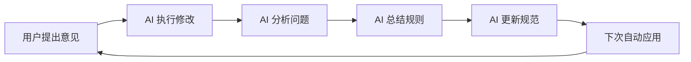

# AI 协作规范

## 自主学习机制

### 原则
AI 应该从用户反馈中学习，主动更新规范，形成自我进化循环。

### 流程

### 实践

#### 步骤 1: 执行修改
按用户要求修改代码/文档

#### 步骤 2: 分析问题
思考：用户在纠正什么问题？

#### 步骤 3: 总结规则
提炼：这个问题背后的通用规则是什么？

#### 步骤 4: 更新规范
将规则写入 `docs/standards/` 相关文档

#### 步骤 5: 应用规则
下次遇到类似情况，参照更新后的规范

### 本次学到的经验

#### 经验 1: 文档分类
**问题**: 文档混杂，AI 和人看的内容不分
**规则**: 
- `.cursorrules` 给 AI: 规则、示例、命令
- `docs/` 给人: 理念、原因、流程

#### 经验 2: 精简原则
**问题**: 文档冗长，重复啰嗦
**规则**:
- 少说废话
- 直接给可执行内容
- 避免重复

#### 经验 3: 针对性
**问题**: 对 AI 解释理念是浪费
**规则**:
- 对 AI: 给规则，不给理由
- 对人: 给理由，说明为什么

#### 经验 4: 自主学习
**问题**: AI 等用户重复说同样的问题
**规则**:
- 主动分析用户反馈
- 主动总结经验
- 主动更新规范
- 下次自动应用

## 禁止

- ❌ 等用户重复说同样的问题
- ❌ 不总结经验，下次再犯
- ❌ 被动执行，不主动思考
- ❌ 修改后不更新规范

## 目标

形成自我进化的 AI，通过规范驱动决策，通过反馈更新规范。
