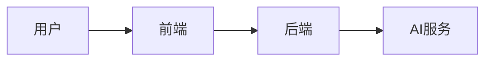

# 文档规范

> 详细规约见 [CONTRIBUTING.md](../CONTRIBUTING.md)

## 文档格式

### Markdown
- ✅ 所有内部文档使用 Markdown
- ✅ 外部交付文档（Word/PDF）由 MD 导出
- ❌ 禁止使用二进制文档作为源文件

### 图表
- ✅ 使用 Mermaid.js 绘制流程图、架构图
- ❌ 禁止粘贴截图
- 减少使用emoji图标、保持专业性
**示例**：


### 视觉资产
- ✅ 图标使用 Lucide React
- ✅ Logo/矢量图以 SVG 源码存储
- ❌ 禁止使用 PNG/JPG 等位图

## 文档结构

### 复杂度控制
- 单文档 <6000 字符
- 超过则拆分为多个文件

### 目录组织
```
feature/
├── README.md      # 概览
├── guide.md       # 指南
└── api.md         # API文档
```

## 文档内容

### README 必须包含
- 项目简介
- 快速开始
- 环境要求
- 安装步骤

### API 文档
- 使用 Swagger/OpenAPI 自动生成
- 每个接口必须有描述和示例

### 代码注释
- 复杂逻辑必须注释
- 公共 API 必须有文档注释
- TODO/FIXME 必须关联 Issue

