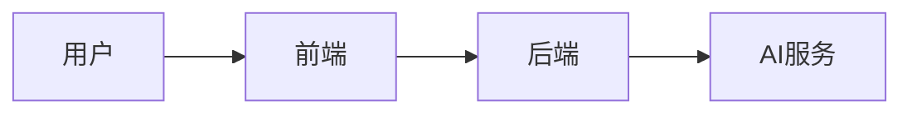

# 文档规范

> 详细规约见 [CONTRIBUTING.md](../CONTRIBUTING.md)

## 文档格式

### AI 自主学习机制
**重要**: 当发现新的经验或规则时，AI 应主动更新相关规范文档。

**流程**:
1. 用户提出改进意见
2. AI 执行修改
3. AI 分析问题本质
4. AI 总结可复用的规则
5. AI 更新 `docs/standards/` 相关文档
6. 下次自动应用新规则

**目的**: 形成自我进化的循环，避免重复犯错。

### Markdown
- ✅ 所有内部文档使用 Markdown
- ✅ 外部交付文档（Word/PDF）由 MD 导出
- ❌ 禁止使用二进制文档作为源文件

### 图表
- ✅ 使用 Mermaid.js 绘制流程图、架构图
- ❌ 禁止粘贴截图
- 减少使用emoji图标、保持专业性
**示例**：


### 视觉资产
- ✅ 图标使用 Lucide React
- ✅ Logo/矢量图以 SVG 源码存储
- ❌ 禁止使用 PNG/JPG 等位图

## 文档结构

### 复杂度控制
- 单文档 <6000 字符
- 超过则拆分为多个文件

### 写作原则
- 精简，避免杂乱
- 直接给出可执行的内容
- 避免冗长的解释和重复

### 文档分类原则

#### 给 AI 看的文档 (.cursorrules)
**目的**: 让 AI 生成符合规范的代码

**内容**: 规则、示例、命令
**禁止**: 解释理念、讲故事、说明原因

**示例**:
```markdown
# 好 ✅
- 组件: `PascalCase.tsx`
- 工具: `camelCase.ts`

# 不好 ❌
我们采用 PascalCase 是因为...（AI 不需要知道原因）
```

#### 给人看的文档 (docs/)
**目的**: 让人理解架构和决策

**内容**: 理念、原因、流程
**可以**: 解释为什么、说明背景、展示全局

**示例**:
```markdown
# 好 ✅
## 为什么 Contract-First？
问题: 接口不一致
解决: 先定义契约
好处: 保证一致性

# 不好 ❌
使用 Contract-First...（没说为什么）
```

### 针对性原则
- **对 AI**: 给规则，不给理由
- **对人**: 给理由，说明为什么

### 目录组织
```
feature/
├── README.md      # 概览
├── guide.md       # 指南
└── api.md         # API文档
```

## 文档内容

### README 必须包含
- 项目简介
- 快速开始
- 环境要求
- 安装步骤

### API 文档
- 使用 Swagger/OpenAPI 自动生成
- 每个接口必须有描述和示例

### 代码注释
- 复杂逻辑必须注释
- 公共 API 必须有文档注释
- TODO/FIXME 必须关联 Issue

## 审核补充规则（2026-02-23）

- API 示例路径必须统一包含版本前缀（如 `/api/v1`）。
- 架构文档新增/重构后必须执行一次链接可达性检查，禁止保留断链。
- 错误响应格式在所有文档中保持单一口径，避免同仓库多种定义并存。

