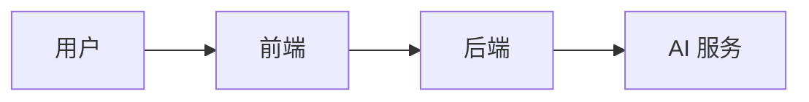

# 文档规范（精简版）

> 详细协作要求见 [CONTRIBUTING.md](../CONTRIBUTING.md)

## 目标

建立一套可维护、可校验、与代码一致的文档系统。

## 基础规则

- 文档统一使用 Markdown。
- 单一事实源优先：
  - 技术栈：`docs/architecture/tech-stack.md`
  - 架构入口：`docs/README.md`
- 当前系统总索引：`docs/documentation/source-of-truth.md`
- 规划项必须标注“规划中”。
- 重要文档应显式标记状态：`current` / `active design` / `compatibility` / `historical` / `retired`
- 删除文档后必须修复引用。

## 图表规则（Mermaid）

- 仅在需要表达流程/结构时使用 Mermaid。
- 标签包含括号或标点时，使用引号包裹。
- 提交前检查 Mermaid 代码块语法。

示例：

## 结构与写作

- 文档应短小、可执行，避免重复背景叙述。
- 目录级 README 只保留：定位、入口、维护清单。
- 复杂专题拆分后，入口页必须维护链接。

## 提交前检查清单

- [ ] 关键链接可达
- [ ] Mermaid 可解析
- [ ] “已落地/规划中”标注准确
- [ ] 没有重复维护技术栈表格
