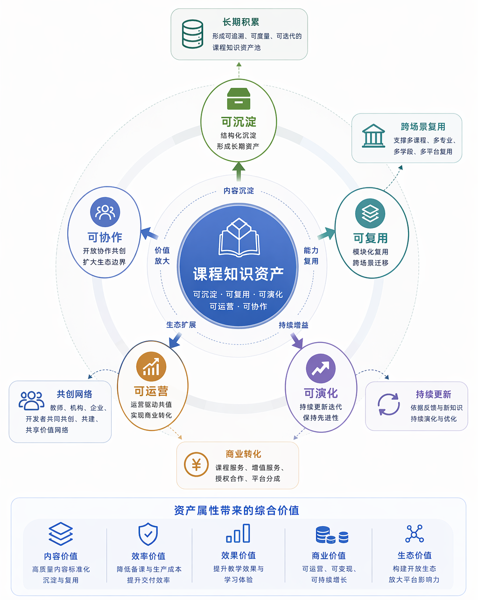
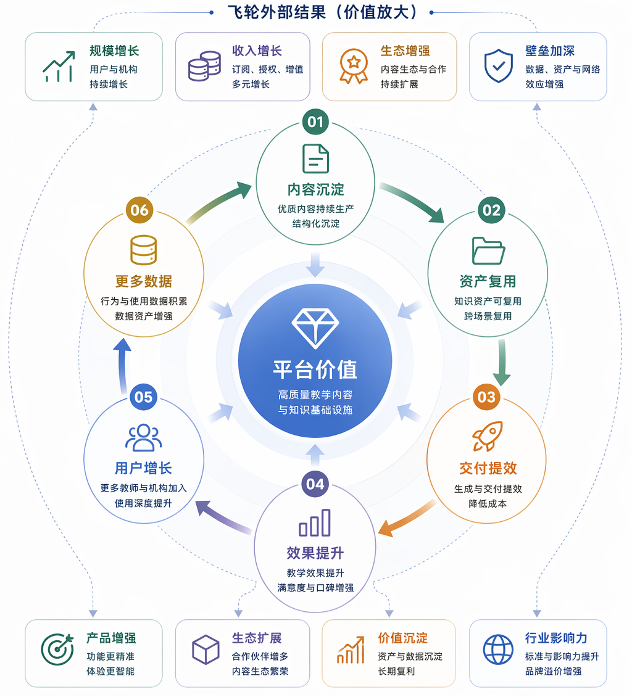
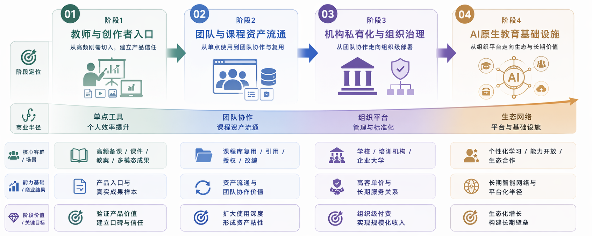

# 8. 商业企划

## 8.1 商业定位：课程知识资产网络

Spectra 的商业定位是面向教育内容生产、课程资产经营和个性化学习服务的课程知识资产网络。

::: {custom-style="Body Text"}
在该商业模型中，长期价值来源于围绕 Project / 课程库 形成的知识状态、引用关系、版本演化、成员权限和多模态外化能力。系统帮助用户将一次备课、一组资料、一段课程经验和一次交付结果，沉淀为可持续复用、授权、演化和交易的课程知识资产。
:::

::: {custom-style="Body Text"}
传统教育软件提供功能性订阅服务，Spectra 则建设教育内容底座：优质课程库作为数字资产被持续调用、持续扩展、持续外化，形成跨创作者、跨团队、跨机构的知识网络。网络规模越大，平台的内容生产能力、学习服务能力和组织治理能力越强，体现规模经济效应。
:::

::: {custom-style="Body Text"}
商业战略演进路径：
:::

::: {custom-style="Body Text"}
**从教师效率工具，演进为课程知识资产平台，再演进为 AI 原生个性化学习基础设施。**
:::

::: {custom-style="Body Text"}
该路径体现边际成本递减特征：初期投入建设基础能力，随着课程库资产积累，单位服务成本持续下降，网络协同效应逐步显现。
:::

## 8.2 课程知识资产的单元化经营

Project / 课程库 是 Spectra 商业模型中的核心资产单元。高质量课程库不仅是文件夹或资源包，而是可生成、可引用、可授权、可外化、可演化、可交易的知识资产单元，支撑单元化经营模式。

<!-- figure-block {"figure_id": "fig-image20-01", "source_image": "image20.png", "source_chapter": "商业企划", "source_caption": "图 8-1 展示课程库作为资产单元的商业结构。", "width_hint": "6.82283in", "height_hint": "8.55906in"} -->
{width="6.82283in" height="8.55906in"}

图 8-1 展示课程库作为资产单元的商业结构。
<!-- /figure-block -->

::: {custom-style="Body Text"}
课程库具备五类商业属性：
:::

  ----------------------------------------------------------------------------------------------------------------
  **属性**   **含义**                                                 **商业价值**
  ---------- -------------------------------------------------------- --------------------------------------------
  可引用     其他课程库、创作者或学习任务可引用                       形成知识网络和影响力扩散，实现网络协同效应

  可授权     课程库可按权限开放给个人、团队、机构或学习者             支撑订阅、购买、授权和组织采购

  可外化     同一课程库可派生 PPT、教案、导图、动画、互动练习等结果   放大一次建设的交付形态，降低边际成本

  可演化     版本、候选变更和反馈可持续推动课程库更新                 形成长期资产，实现资产增值

  可交易     高质量课程库可成为平台内的付费内容、授权资源或机构资产   支撑创作者收益和平台抽成
  ----------------------------------------------------------------------------------------------------------------

  : 表 8-1

::: {custom-style="Body Text"}
优质课程库被引用、使用、外化和演化的频次越高，其资产价值越高。通过单元化经营，平台围绕资产单元建立生产、分发、授权、学习和再创造网络，实现规模经济。
:::

## 8.3 角色不是本体：权限组合与关系网络

在 Spectra 的商业系统中，教师、学生、创作者、学习者、机构管理员并不是固定不变的本体。真正稳定的是课程库、权限组合和关系网络。

::: {custom-style="Body Text"}
同一个人可以在不同课程库中扮演不同角色：
:::

- 在自己创建的课程库中，他是创作者和管理者；

- 在别人开放的课程库中，他可以是学习者、引用者或协作者；

- 在机构空间中，他可能是课程负责人、审核者、成员管理员或内容贡献者；

- 在平台生态中，他还可能通过优质课程库获得收益。

因此，Reference / Version / CandidateChange / Member 不只是技术对象，也对应商业对象：

  -------------------------------------------------------------------------------------------
  **对象**          **技术含义**                     **商业含义**
  ----------------- -------------------------------- ----------------------------------------
  Reference         一个知识空间引用另一个知识空间   授权、引用、分发和收益关系的基础

  Version           正式状态锚点                     课程资产质量、交付版本和交易对象的依据

  CandidateChange   候选变更入口                     内容共创、审核、改编和持续更新的机制

  Member            成员和权限边界                   组织治理、付费权限和收益分配的基础
  -------------------------------------------------------------------------------------------

  : 表 8-2

::: {custom-style="Body Text"}
这种设计让 Spectra 的商业模式不只面向"谁买账号"，而是面向"谁拥有、谁引用、谁使用、谁外化、谁收益、谁治理"。
:::

## 8.4 商业飞轮：规模经济与网络协同效应

Spectra 的平台价值来自课程知识资产飞轮，通过规模经济和网络协同效应实现边际成本递减。

<!-- figure-block {"figure_id": "fig-image21-02", "source_image": "image21.png", "source_chapter": "商业企划", "source_caption": "图 8-2 展示核心商业逻辑：课程库越多、引用越多、外化越多，平台的收入和 AI 能力越强，边际成本持续下降。", "width_hint": "6.3937in", "height_hint": "7.05118in"} -->
{width="6.3937in" height="7.05118in"}

图 8-2 展示核心商业逻辑：课程库越多、引用越多、外化越多，平台的收入和 AI 能力越强，边际成本持续下降。
<!-- /figure-block -->

1.  创作者低门槛建库 教师、培训师、企业讲师、知识创作者通过 Studio 和六个能力层，将资料、教学经验和生成结果沉淀为课程库。

<!-- -->

1.  课程库被使用、引用和外化 学习者、其他创作者、教研组或机构围绕课程库生成导图、复习讲义、互动练习、说课材料、学情预演等外化结果。单一课程库可派生多种交付形态，体现边际成本递减特征。

2.  平台形成多层收入 平台通过工具订阅、增值能力、课程库授权、交易抽成、机构交付、私有化部署和服务费获得收入。

3.  使用产生更多资产和关系 更多课程库、引用关系、学习行为、多模态成果和版本演化沉淀到平台，形成更丰富的知识网络，实现网络协同效应。

4.  知识网络增强 AI 能力 更丰富的课程资产和使用反馈，进一步提升检索、推荐、生成、个性化学习和组织治理能力。平台能力随资产积累而增强，体现规模经济。

5.  更强能力吸引更多参与方 更好的学习体验、更高的创作者收益和更强的机构治理能力，吸引更多创作者、学习者和组织进入平台。

该飞轮的核心机制在于：用户不仅是使用者，也是课程资产和网络价值的共同建设者。平台价值来自课程知识网络持续增长后形成的规模经济与网络协同效应。

::: {custom-style="Body Text"}
该复利效应首先体现在系统能力层面：课程库越多，平台越易形成更强的引用网络；引用网络越强，平台越能沉淀更可复用的内容结构；外化和学习反馈越丰富，平台越能形成更强的检索、生成、推荐和个性化学习能力。随着使用规模扩大，单位服务的边际成本持续下降，平台逐步接近长期教育内容基础设施。
:::

## 8.5 客户与参与方分层

Spectra 的商业对象不应只写成"教师个人"和"学校机构"。更准确的分层，是围绕课程库资产关系展开。

  --------------------------------------------------------------------------------------------------------------------
  **参与方**              **核心需求**                             **可购买或贡献的价值**
  ----------------------- ---------------------------------------- ---------------------------------------------------
  个人教师 / 知识创作者   更高效地生产课程内容，形成个人课程资产   订阅、生成额度、高级模型、导出能力、个人空间

  教研组 / 创作团队       协作建设、复用和维护课程库               团队空间、成员权限、协作流程、共享资产治理

  学习者                  围绕课程库获得更适合自己的学习材料       导图、复习讲义、互动练习、AI 助教、个性化学习路径

  高质量课程库创造者      让优质课程资产被更多人引用和付费使用     课程库授权、订阅分成、交易收益、品牌影响力

  学校 / 培训机构         管理校本资源、课程资产和组织权限         私有化部署、资源接入、权限治理、品牌化和定制服务

  教育平台 / 企业大学     大规模内容生产、分发和学习服务运营       平台级能力集成、内容资产治理、数据闭环和长期服务
  --------------------------------------------------------------------------------------------------------------------

  : 表 8-3

::: {custom-style="Body Text"}
这种分层让商业模式从单纯卖账号，升级为围绕课程库资产的生产、使用、授权、学习、交易和治理。
:::

## 8.6 五层收入结构

<!-- figure-block {"figure_id": "fig-image22-04", "source_image": "image22.png", "source_chapter": "商业企划", "source_caption": "Spectra 适合采用五层收入结构，而不是单一订阅模型。", "width_hint": "4.358333333333333in", "height_hint": "5.654166666666667in"} -->
{width="4.358333333333333in" height="5.654166666666667in"}

Spectra 适合采用五层收入结构，而不是单一订阅模型。
<!-- /figure-block -->

::: {custom-style="caption"}
图 8-3 对应从入口到复利层层抬升的平台收入结构。
:::

### 8.6.1 工具订阅层

这是最容易启动的入口层，面向个人教师、知识创作者、培训师和企业讲师。

::: {custom-style="Body Text"}
可收费内容包括：
:::

- 基础订阅；

- 生成额度；

- 高级模型能力；

- 多模态外化能力；

- 标准导出能力；

- 私有课程空间容量；

- 高级 Studio 卡片能力。

这一层的价值是降低使用门槛，快速形成真实课程库和多模态成果样本。

### 8.6.2 课程资产层

当课程库成为可引用、可授权、可演化的资产节点后，平台可以形成课程资产层收入。

::: {custom-style="Body Text"}
可收费内容包括：
:::

- 优质课程库订阅；

- 课程库购买；

- 课程库授权；

- 引用和改编权限；

- 团队或机构使用授权；

- 创作者收益分成与平台抽成。

这一层的价值是让优质课程库的创造者获得收益，也让平台从知识资产流通中获得长期收入。

### 8.6.3 学习增值层

学习者围绕课程库可以购买更个性化的学习服务。这里的价值不只是"看课程"，而是基于课程库进行二次组织和个性化外化。

::: {custom-style="Body Text"}
可收费内容包括：
:::

- 个人思维导图；

- 复习讲义；

- 互动练习；

- 错题强化；

- AI 助教；

- 个性化学习路径；

- 面向考试或项目目标的专项学习包。

这一层把课程库从教师生产资产，扩展为学习者可持续消费和个性化使用的基础。

### 8.6.4 组织平台层

学校、培训机构和企业大学需要的是组织级课程资产系统。

::: {custom-style="Body Text"}
可收费内容包括：
:::

- 私有化或本地化部署；

- 校本资源接入；

- 组织、成员和权限治理；

- 品牌化工作台；

- 教研流程适配；

- 专属模型、检索和交付配置；

- 持续运维、培训和质量保障。

这一层是高客单价和长期服务的主要来源，也是 Spectra 从工具走向平台的关键商业场景。

### 8.6.5 长期智能网络层

长期看，平台沉淀的课程库、引用网络、多模态成果、学习行为和质量反馈，会构成 AI 原生教育基础设施。

::: {custom-style="Body Text"}
这一层的商业价值体现在：
:::

- 更精准的课程推荐；

- 更强的检索与证据组织；

- 更稳定的个性化学习服务；

- 更高质量的内容生成与改编；

- 面向机构和平台客户的知识资产分析；

- 面向未来教育产品的能力开放与生态合作。

这一层是平台长期增长和估值空间的重要来源。它决定了 Spectra 为什么值得被当作长期平台来建设。

## 8.7 市场进入路径

<!-- figure-block {"figure_id": "fig-image23-05", "source_image": "image23.png", "source_chapter": "商业企划", "source_caption": "Spectra 的市场进入应采用由轻到重、由工具到资产、由单点到平台的路径。", "width_hint": "8.072222222222223in", "height_hint": "3.1805555555555554in"} -->
{width="8.072222222222223in" height="3.1805555555555554in"}

Spectra 的市场进入应采用由轻到重、由工具到资产、由单点到平台的路径。
<!-- /figure-block -->

::: {custom-style="caption"}
图 8-4 对应市场进入节奏：先用高频生产场景切入，再扩展到课程资产流通、机构治理和长期智能网络。
:::

### 8.7.1 第一阶段：教师与创作者入口

以"高质量备课 + 多模态外化 + 真实预览修改"为切入点，让个人用户快速感知效率提升。

::: {custom-style="Body Text"}
阶段目标：
:::

- 获得真实用户和真实课程库；

- 建立多模态外化成果样本；

- 形成可展示的生成、预览、导出和沉淀闭环；

- 用订阅和额度模型验证基础付费意愿。

### 8.7.2 第二阶段：团队与课程资产流通

在个人使用基础上，引入课程库引用、协作、授权和复用场景。

::: {custom-style="Body Text"}
阶段目标：
:::

- 让高质量课程库被更多人使用；

- 建立创作者收益和平台抽成逻辑；

- 验证课程库作为资产节点的商业价值；

- 将 Reference、Version、Member 的系统能力转化为商业能力。

### 8.7.3 第三阶段：机构私有化与组织治理

面向学校、培训机构和企业大学提供组织级交付。

::: {custom-style="Body Text"}
阶段目标：
:::

- 接入校本资源和已有课程体系；

- 提供组织、成员、权限和品牌化能力；

- 用私有化部署、定制服务和持续运维形成高客单价收入；

- 让课程库从个人资产升级为组织资产。

### 8.7.4 第四阶段：AI 原生教育基础设施

在课程库、引用网络和学习行为持续增长后，平台可以向更大范围的个性化学习和教育内容生态演进。

::: {custom-style="Body Text"}
阶段目标：
:::

- 形成跨课程、跨机构、跨学习场景的知识网络；

- 提供更强的个性化学习服务；

- 通过生态合作、能力开放和数据智能提升长期平台价值；

- 让 Spectra 从产品工具演进为教育知识资产基础设施。

## 8.8 竞争优势与网络效应

普通 AI 课件工具的价值通常止步于"生成一份结果"。Spectra 的优势在于，它把生成结果放入课程库、引用关系、版本演化和多模态交付体系中，让每次使用都能增加后续价值。

<!-- figure-block {"figure_id": "fig-image24-03", "source_image": "image24.png", "source_chapter": "商业企划", "source_caption": "图 8-5 对应平台生态关系：平台在创作者、学习者、团队、学校、机构和课程库之间组织长期关系。", "width_hint": "6.10903in", "height_hint": "8.61667in"} -->
{width="6.10903in" height="8.61667in"}

图 8-5 对应平台生态关系：平台在创作者、学习者、团队、学校、机构和课程库之间组织长期关系。
<!-- /figure-block -->

  ----------------------------------------------------------------------------------
  **维度**   **普通 AI 课件工具**   **Spectra**
  ---------- ---------------------- ------------------------------------------------
  商业本体   单次生成工具           课程知识资产网络

  资产形态   文件或任务记录         可引用、可授权、可演化的课程库

  参与方     主要是教师个人         创作者、学习者、团队、学校、机构和平台客户

  收入模型   订阅或额度             订阅、增值、授权、交易抽成、机构交付、长期服务

  用户行为   使用后结束             使用、引用、外化、回流、演化

  长期价值   功能竞争               知识网络、创作者生态和学习数据复利
  ----------------------------------------------------------------------------------

  : 表 8-4

::: {custom-style="Body Text"}
Spectra 的网络效应来自三个方向：
:::

1.  课程库越多，学习者和创作者可引用的资产越多；

<!-- -->

1.  引用和外化越多，平台越能理解课程知识之间的关系；

2.  学习和使用反馈越多，检索、生成、推荐和个性化服务越强。

这种优势由课程资产、对象关系、用户行为和 AI 能力共同形成。对外可以把它理解为平台级护城河：一旦高质量课程库、引用关系、成员网络和学习反馈持续积累，后来者即使复制部分功能，也难以在短时间内复制同样的资产网络和复利结构。

## 8.9 为什么客户愿意购买

不同客户愿意购买 Spectra 的原因并不相同，但都围绕课程库资产展开。

::: {custom-style="Body Text"}
对个人教师和知识创作者而言，购买理由是：
:::

- 更快生产高质量教学内容；

- 一次备课可以派生多种成果；

- 个人课程库可以长期复用；

- 优质课程资产未来具备收益空间。

对学习者而言，购买理由是：

- 可以围绕课程库获得更适合自己的学习材料；

- 能使用导图、练习、复习讲义、AI 助教等增值能力；

- 学习内容不再只是静态文件，而是可以持续外化和个性化组织。

对学校和机构而言，购买理由是：

- 教师个人成果可以转化为组织课程资产；

- 校本资源可以被统一治理和持续更新；

- 课程内容生产、交付、权限和复用可以进入同一系统；

- 私有化、权限治理和定制服务能满足组织级采购要求。

对平台型客户而言，购买理由是：

- 可以获得课程内容生产和知识资产治理底座；

- 可以面向大量学习者提供更丰富的 AI 原生学习服务；

- 可以把内容、用户、学习行为和知识网络组织成长期业务资产。

这使 Spectra 的购买理由不只是"省时间"，而是"让课程内容变成可持续经营的知识资产"。

## 8.10 商业结论

Spectra 的商业成立性在于：将课程内容生产、知识状态管理、多模态外化、引用复用、权限治理和长期学习服务组织成平台型系统，建立了稳固的商业逻辑闭环。

::: {custom-style="Body Text"}
商业战略演进路径：
:::

- 短期：作为教师和创作者的效率工具切入市场；

- 中期：发展为课程知识资产平台，实现优质课程库的引用、授权、交易和持续演化；

- 长期：演进为 AI 原生个性化学习基础设施，支撑更大规模的教育内容生产、学习服务和知识资产治理。

核心商业判断：

::: {custom-style="Body Text"}
**Spectra 正在建设围绕课程知识资产持续增长的商业生态，通过规模经济与网络协同效应实现可持续增长。**
:::

::: {custom-style="Body Text"}
愿景与长效社会价值：
:::

::: {custom-style="Body Text"}
Spectra 的长期价值在于建设教育内容底座：将课程库转化为可持续经营的知识资产，通过资产网络放大创作者价值、学习者价值和组织价值。该模式通过边际成本递减和网络协同效应，实现教育资源的高效配置与公平分发，具备显著的长效社会价值。
:::
