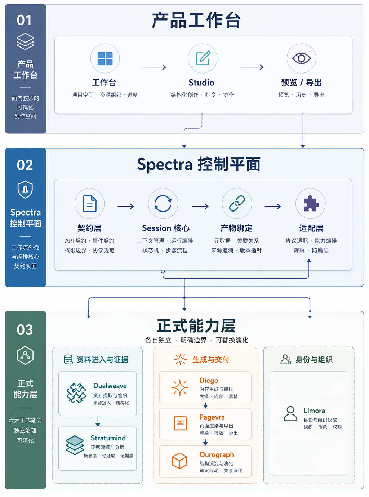

# 系统亮点

`Spectra` 的亮点，不是单个功能多，而是把“资料进入 - 会话生成 - 多结果交付 - 结果保存”组织成同一套结构。

{width="5.0in" height="6.7in"}
图 4 三层结构示意图，展示产品工作台、控制平面和正式能力层之间的分工关系。

当前作品最核心的三点优势是：

- 一个工作台承接资料、生成和结果，不再来回切工具；
- 一条主链控制 `outline`、确认、生成和修改，结果更可控；
- 多个能力模块分工清楚，结果还能继续回看、保存和复用。
