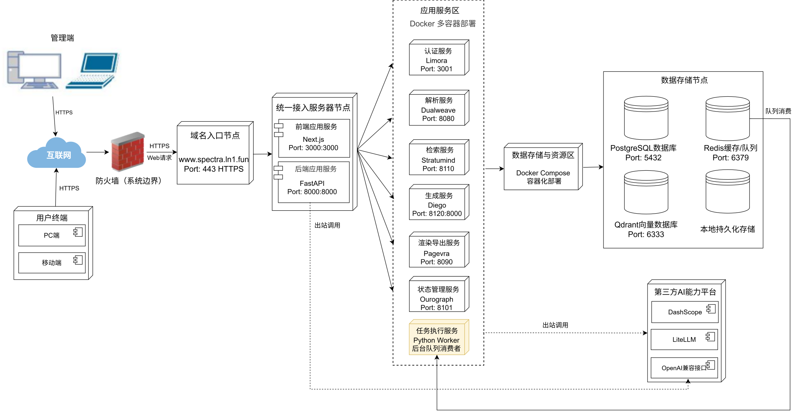

# 开发工具与技术

前端采用 `Next.js + React + TypeScript`，后端采用 `FastAPI`，数据底座由 `PostgreSQL`、`Redis`、`RQ`、`Qdrant` 等组件组成。技术路线重点围绕会话生成、知识库检索和标准导出展开。

{width="7.0in" height="3.6in"}
图 5 当前部署架构图，展示统一入口、应用节点、能力服务和数据节点之间的连接方式。

{width="7.0in" height="3.15in"}
图 6 检索与证据核心流程图，展示查询改写、召回、重排、证据打包与观测链路。

`Spectra` 不是只做页面展示，而是已经把前端交互、后端编排、检索增强和结果交付连成了工程链。
