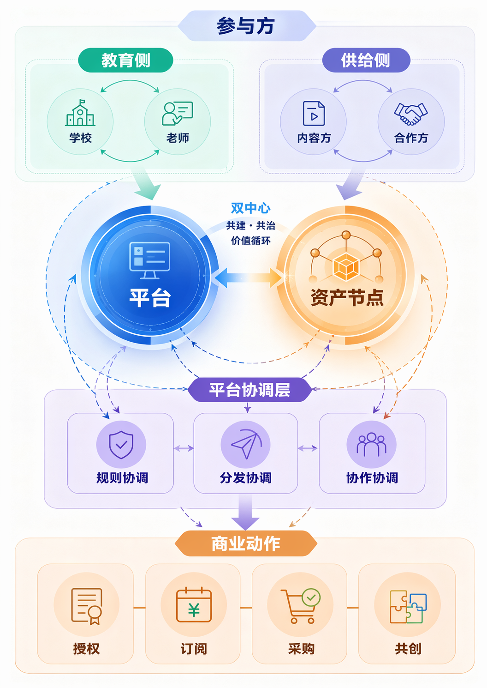

# 应用对象与应用环境

当前作品首先面向一线教师，也适合教研组、课程团队等需要持续整理教学资料的场景。

{width="4.8in" height="7.4in"}
图 5 参与方关系示意图，反映教师、学校、内容侧和合作侧围绕平台与资产节点形成的协作关系。

主要应用对象包括：

- 教师侧：直接使用工作台完成资料组织、会话生成和结果导出；
- 学习者侧：承接课件、文档、导图、互动内容等多种结果形式；
- 教研组或学校侧：在已有资料进入、结果保存和后续复用基础上开展协作使用。

在应用环境上，系统当前主要运行于 `Web` 端工作台，适用于备课、说课、校本资源整理和课程内容持续更新等教学场景。
