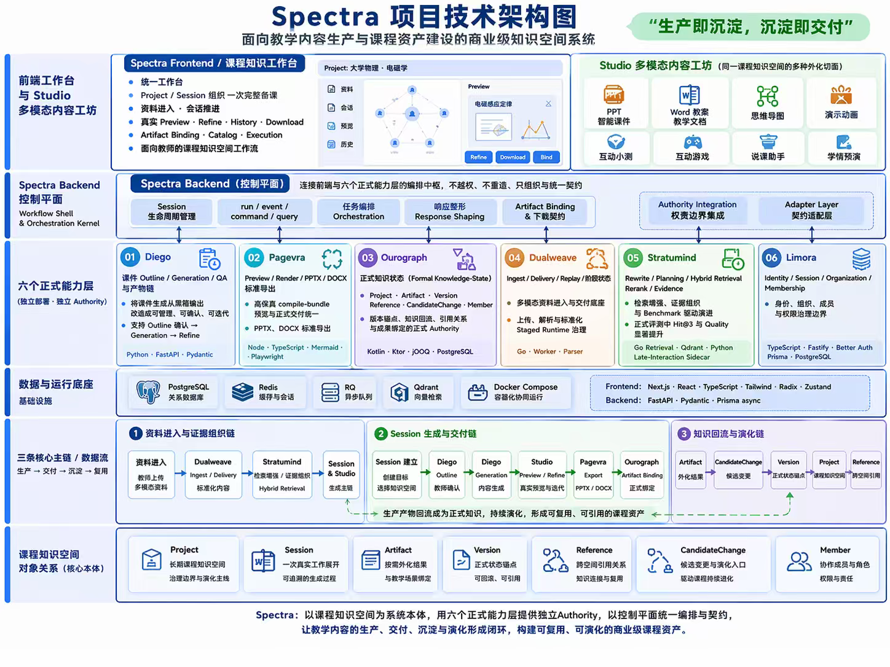
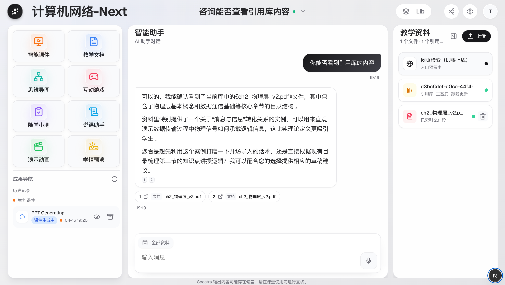
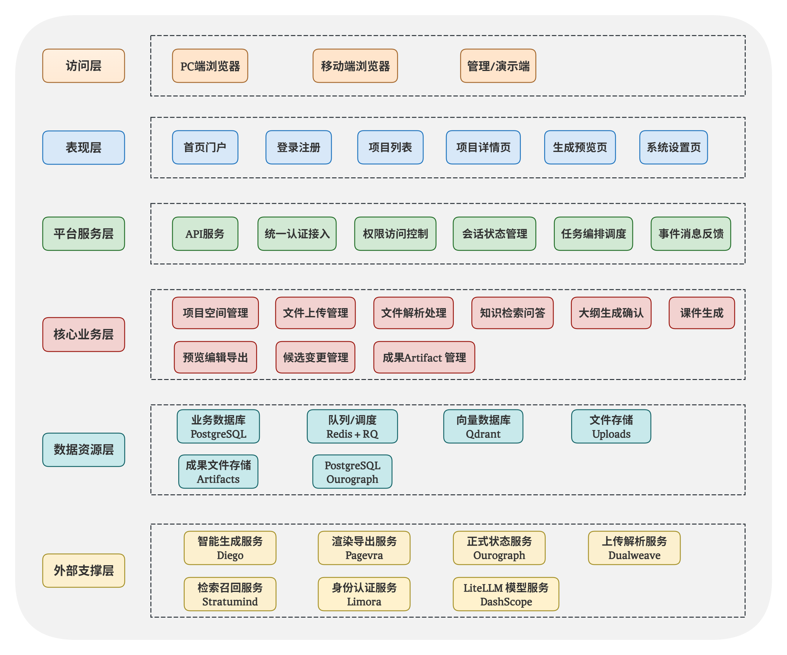

<!-- anchor: anchors/05-系统设计/01-整体架构.yaml -->

## 系统整体架构

系统整体可概括为三层：前端工作台、后端编排层和核心能力承接层。用户在前端工作台中完成资料进入、会话推进、结果查看和下载；后端负责组织连续流程；生成、渲染、检索、结果保存和权限等能力由不同模块分别承接。该架构的目标是形成统一工作面，而不是若干彼此脱节的工具。

这套架构处理的核心问题，是将资料进入、生成、交付和保存组织为同一条连续链路，使一次生成能够衔接后续修改、导出和复用。教学准备场景的关键不在单个模型能否产出一页内容，而在资料、会话、生成结果和后续修改能否落在同一套结构里。系统整体架构因此优先服务于连续工作过程。

{width="7.2in" height="5.3in"}
图 5-1 系统整体架构图，展示了资料进入、生成、预览和结果保存之间的主要关系。

从作品实现看，这张图对应一条清楚的主线：资料先进入系统，再参与检索和生成，生成结果进入预览与导出，最后保存回项目资料链路。前端看到的是统一工作台和 Studio 相关页面，后端承接的是 `Session`、事件、任务和结果绑定，生成、预览导出、资料检索和结果保存分别由不同能力链路负责。图 5-1 展示的就是这几部分如何围绕同一条工作主线配合。

{width="7.2in" height="4.1in"}
图 5-2 前端工作台截图，说明 Studio、智能助手、资料区与结果区如何在同一界面中组成统一工作面。

这张截图对应当前作品中最直接可见的工作台形态。左侧为多种成果入口与历史记录区，中部为会话推进与结果承接区，右侧为教学资料与引用资料区。资料、对话、生成、预览和结果查看在同一界面内连续展开，因此“统一工作台”并不是抽象口号，而是当前页面结构本身。

{width="7.2in" height="6.0in"}
图 5-3 系统功能架构图，说明访问层、表现层、平台服务层、核心业务层、数据资源层与外部支撑层之间的职责分工。

这张图补充了图 5-1 与图 5-2 中较抽象的工作主线，把当前实现进一步拆成可辨认的功能层次。访问层对应 PC 端浏览器、移动端浏览器以及管理或演示入口；表现层对应首页、登录注册、项目列表、项目详情、生成预览和系统设置等用户可见页面；平台服务层承接 API 服务、统一认证、权限控制、会话状态管理、任务编排调度与事件消息反馈；核心业务层承接项目空间管理、文件上传管理、文件解析处理、知识检索问答、大纲生成确认、课件生成、预览编辑导出、候选变更管理与 `Artifact` 管理；数据资源层与外部支撑层则分别对应 PostgreSQL、Redis + RQ、Qdrant、Uploads 以及 Diego、Pagevra、Ourograph、Dualweave、Stratumind、Limora 和 DashScope 等能力来源。

当前整体架构可进一步分为：

- 前端工作台层：统一承接资料、对话、生成、预览和结果管理等操作；
- 后端编排层：围绕 `Session`、事件和结果绑定组织主链，负责把不同能力连接成可推进流程；
- 能力承接层：分别承担生成、渲染导出、知识库检索、结果状态和身份边界等职责。

这一拆分可以直接对应到当前作品。前端工作台对应 Studio、Chat、Sources 和结果查看界面；后端编排层对应会话、预览和结果绑定相关接口与服务；能力承接层对应生成、检索、导出和结果保存等实际模块。用户在界面上看到的是一个连续工作面，但系统内部并没有把所有能力混写在一个大模块里，而是通过清楚的接口和职责划分，把资料进入、生成、查看、导出和保存组织为一条可追踪的链路。

从系统长期维护的对象看，当前结构至少稳定承接五类内容：项目资料、工作过程、结果对象、结果版本和结果之间的引用关系。`Project` 对应项目资料与结果统一管理空间，`Session` 对应一次具体工作过程，`Artifact` 对应生成结果对象，`Version` 对应结果的稳定版本锚点，`Reference` 则承接不同资料和结果之间的复用关系。这组对象界定了系统长期管理的核心内容。

这一整体架构带来三个直接结果。第一，前端不再是若干独立演示页面，而是统一承接资料、生成、预览、修改和下载的产品面。第二，后端不再只转发请求，而是围绕 `Session`、事件和结果绑定组织连续工作过程。第三，生成、检索、导出和结果保存之间不再断裂，生成结果可以继续进入预览、导出和保存链路。这也是后续模块设计、数据流程和数据库设计能够成立的前提。

当前系统已经形成“统一工作台 + 连续主链 + 清楚分工”的整体设计。前端页面、后端编排和能力承接层围绕教师备课主流程共同运行，输入、组织、生成、预览、导出和保存都落在同一套结构里。后续各节继续展开这套结构中的模块、流程和对象关系。
