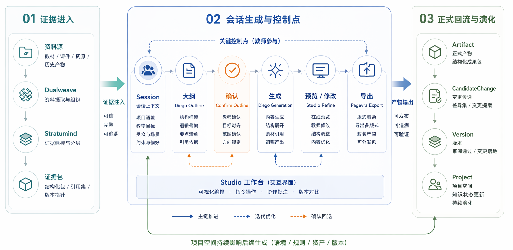
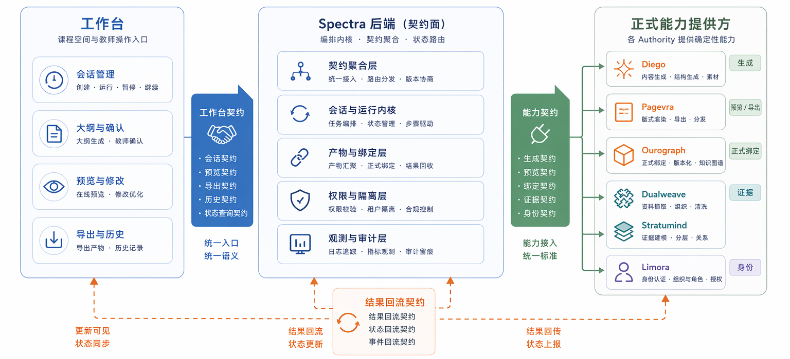

<!-- anchor: anchors/05-系统设计/02-模块设计.yaml -->

## 软件系统模块设计

### 智能课件与内容生成模块

该模块负责围绕一次教学任务生成课件和其他内容结果，并支持 `outline` 确认、正式生成和后续修改。教师的输入、资料证据和修改要求会被组织成连续生成链，而不是一次性输出成品。生成过程因此具备方向确认、正式生成和后续修改三个稳定阶段。

{width="5.1in" height="6.4in"}
图 5-4 生成模块在整体系统中的位置，说明它和工作台、调度层的关系。

在作品中，这一模块对应会话推进、生成阶段控制和结果产出。用户先经过 `outline`、确认、正式生成，再进入预览与修改流程。教师可以在中间阶段判断方向，再决定是否继续推进。页面层面，它主要落在 Studio 的生成流程、会话区域和结果预览入口；接口层面，它与 `Session` 创建、`outline` 确认、正式生成以及后续 refine 请求直接相关；结果层面，它最终产出可以进入预览和导出的正式结果对象。

这一模块之所以被单独提出，是因为当前系统把生成看作连续过程，而不是单次调用。系统会先围绕教师输入组织上下文，再形成中间结构，再进入正式生成。这样做的直接好处是：生成方向可以被人工确认，资料证据可以在正式生成前先进入流程，中间阶段也能被记录和追踪。模块的职责因此不只是“生成内容”，还包括把生成过程变成可解释、可修改、可继续推进的工作链。

### 页面渲染与导出分发模块

该模块负责预览、渲染和标准结果导出，让用户看到的内容和最终下载内容属于同一条链路，而不是临时拼接出来的假预览。教学场景最终需要的是可展示、可交付的标准结果，而不是仅在页面上看起来完成的临时内容。系统将这一部分独立出来，目的就是保证“预览”和“交付”属于同一结果链，而不是前端展示一套内容、导出再临时拼接另一套内容。

{width="7.0in" height="3.5in"}
图 5-5 结果预览与导出链路，反映结果如何从生成过程进入预览和导出。

在作品中，这一模块对应 preview、history、download 等结果操作。它将“看到结果”“继续修改”“下载交付”统一起来，避免前端展示和最终导出脱节。由此，系统能够稳定支持课件和文档类结果的查看、修改和导出。查看、回看历史和导出交付都落在同一条结果链中。

从模块分工上看，这一部分至少承担三项职责：第一，接住生成结果并形成可查看的预览；第二，把查看、修改和回看历史这些动作稳定地挂在真实结果之上；第三，将结果输出为可交付的标准文档。模块价值因此不只是“把文件导出来”，而是保证结果链的前后语义一致。

### 知识库与数据检索模块

该模块负责资料解析、知识块组织、检索增强和证据召回。生成前先做内容组织，能减少直接生成时的内容漂移问题。上传进来的资料会被进一步解析、切分、索引和召回，并在后续生成时发挥作用。若缺少这部分，上传行为只能停留在附件管理层，难以真正参与后续内容生成。

{width="7.1in" height="3.2in"}
图 5-6 数据处理与结果回流相关链路，说明检索、导出和结果保存之间的联系。

在作品中，这一模块对应资料上传后的解析处理、知识库组织和后续检索调用；在结果层面，对应第 7 章中的检索质量评估数据。这一模块既有功能链路，也有量化结果支撑。页面上，用户能看到资料上传、资料来源和结果引用；流程上，资料会经历解析、切块、索引和证据组织；结果上，检索链路可以通过 60 题和 105 题正式评估集得到验证。

就模块职责而言，这一部分围绕资料进入和证据组织形成一整条链路。它处理的是当前项目资料如何进入系统、如何变成生成可用的证据、如何在后续结果中继续被引用。这一点也是第 6 章知识库处理技术和第 7 章检索评估的基础。

### 用户权限与安全管理模块

该模块负责用户、组织和成员边界。它负责保证不同用户、不同项目和不同结果之间的访问边界清晰。对于当前作品来说，这部分更多体现为系统边界条件，而非核心演示画面，但它决定了资料、结果和协作关系能否在后续继续扩展。若没有这部分，资料与结果只能停留在单用户、单次操作的临时状态，后续协作关系也难以保持清楚。

在作品中，这一模块主要体现在身份、组织和成员边界的独立处理上，使资料、结果和协作关系不会混在一起。它的存在感并不主要来自某一张界面，而来自系统规则：谁能进入某个工作过程、谁能看到某个结果、哪些结果能够挂回项目空间并继续被后续成员使用。模块价值由此更偏向边界控制和长期管理，而不是一次性的演示效果。

模块设计对应四组核心问题：内容生成、结果预览与导出、资料检索与证据组织、身份与成员边界。四组模块均可在当前页面、流程、接口或结果链中找到对应落点。生成模块对应会话推进与正式生成，渲染导出模块对应 preview、history 与 download，知识库模块对应资料进入与检索增强，权限模块对应结果与协作边界。四部分共同构成当前作品中的系统结构，也共同支撑了后续的数据流程和对象关系设计。
