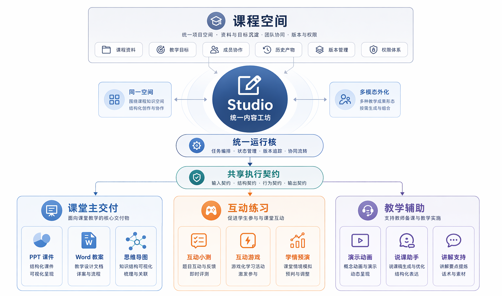

<!-- anchor: anchors/05-系统设计/03-数据处理流程.yaml -->

## 数据处理流程

### 资料进入与证据组织链

这条链路对应“资料上传后如何变成后续生成能用的内容”。在当前系统里，资料进入直接构成后续检索和生成的起点。只有资料真正进入解析、索引和证据组织流程，后面的生成结果才有可能更贴近现有课程内容。系统将这一段放在主链起点，使资料先成为可检索、可引用的证据来源，避免停留在附件层。

资料上传 -> 解析处理 -> 内容标准化 -> 知识块组织 -> 检索准备

这部分在作品中的体现是：资料不会停留在附件层，而会进入后续知识组织和生成流程。资料上传后至少会经过解析、切块、组织和检索准备几个阶段，最终成为会话和生成可用的内容来源。对教师场景而言，这意味着资料上传之后仍继续参与内容组织与结果生成。

从流程职责上看，这条链至少包含四个关键动作。第一，系统接住外部资料并完成基础解析；第二，把可用文本、结构和来源信息标准化；第三，将长资料切分为更适合召回和引用的知识块；第四，将这些知识块进一步组织为可供检索和生成调用的证据集合。上传动作在这里是起点，重点在于资料能否继续参与后续生成。

### 生成与交付链

这条链路对应“从会话开始到生成结果可预览、可导出”的过程。当前作品已经围绕 `Session`、生成模块和导出模块形成一条完整主链：

会话建立 -> `outline` 生成 -> 用户确认 -> 正式生成 -> 预览修改 -> 下载导出

这条链说明系统采用阶段控制的生成流程。教师先通过会话表达意图，再由系统组织生成方向，随后完成正式生成，最后进入预览、修改和导出环节。这样的流程更符合真实备课过程，也与现有界面和接口设计一致。`Session` 在这里对应一次具体工作过程，负责将输入、确认、生成和修改组织为可推进的连续过程。

这条链的关键价值在于把中间阶段保留下来。若没有 `outline` 和确认阶段，生成只能表现为一次黑箱输出；若没有 preview、history 和 download 这些后续动作，结果又会停在“页面上看见过”这一层。当前系统通过这条主链把意图理解、结构组织、正式生成和结果交付串起来，使一轮工作能够被完整描述、回看和继续推进。

### 结果保存与后续复用链

这条链路对应“生成结束后如何把结果保存下来，并为下一次继续使用做准备”。它支撑结果绑定、版本记录和后续修改。这条链决定了系统是停留在生成工具层，还是能够让结果继续留在项目空间中被后续使用。

{width="7.1in" height="4.2in"}
图 5-7 工作台在多种成果输出中的作用，说明同一套资料如何支撑多种结果生成。

这条链意味着结果不只是“导出的文件”，而是能继续挂回项目资料链路中，为后续修改和复用做准备。生成结束后，结果会进入绑定、保存和后续关系组织流程，从而为下一次会话、下一次修改或另一个结果引用提供基础。

按对象语言表述，`Artifact` 是结果对象，`Version` 是结果保存后的版本锚点，`Reference` 承接不同结果或资料之间的复用关系。由此，系统中的结果不再是一次性交付物，而是能够回到项目空间继续被后续工作使用。

三条流程合在一起，可直接看出当前系统的设计思路：

- 第一条链解决“资料如何进入”；
- 第二条链解决“结果如何生成并交付”；
- 第三条链解决“结果如何继续保存和复用”。

这三条链串起来，正好对应老师最关心的那条关系：需求如何落到功能，功能如何落到流程，流程如何落到作品里看得见的内容。第 5 章由此能够把系统设计写成一组连续、可验证的工作过程。资料进入、生成交付和结果回流共同构成同一条业务主线。

系统设计的关键在链路衔接关系：资料进入后支撑生成，生成后的结果进入预览与导出，导出后的结果再回到项目资料与结果统一管理空间中继续复用。由此，“按需外化结果”和“结果回到项目空间”具备了作品层面的落点。三条流程共同说明系统如何组织资料、结果和后续复用关系。
