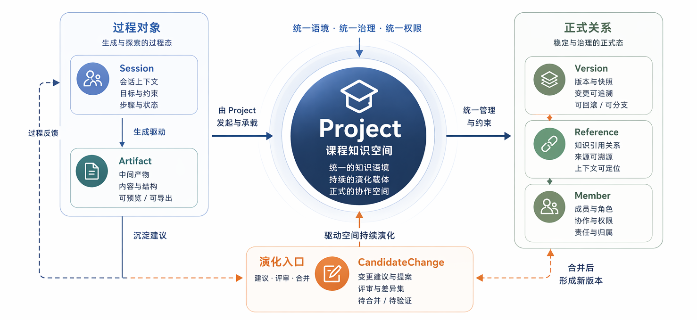
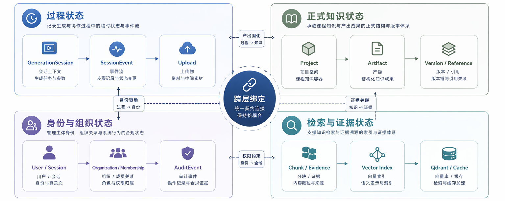
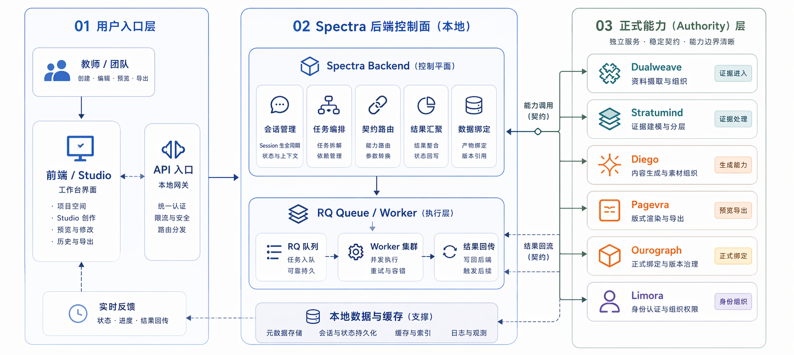

<!-- anchor: anchors/05-系统设计/04-数据库设计.yaml -->

## 数据库设计

数据库设计处理的重点是对象关系和状态流转关系。当前系统把项目、会话、结果、版本和引用关系作为稳定对象组织起来，使结果不再只是导出文件，而是能够继续保存和复用。送审稿不逐项展开字段，而是说明系统长期管理哪些对象，以及这些对象如何支撑当前功能。

{width="6.8in" height="3.1in"}
图 5-8 结果、版本和对象关系示意图，说明系统如何保存和关联生成结果。

{width="7.1in" height="3.1in"}
图 5-9 状态与数据关系示意图，说明过程状态、结果状态和成员边界之间的分工。

{width="7.1in" height="3.2in"}
图 5-10 当前运行拓扑示意图，说明前端、后端和核心模块之间的连接方式。

{width="7.2in" height="3.8in"}
图 5-11 当前部署架构图，说明统一入口、前后端应用节点、外部服务区、数据存储区与第三方能力平台之间的连接关系。

从当前设计看，可以把数据库层重点理解为五组对象关系：

- `Project`：承接一个长期存在的课程项目或资料空间；
- `Session`：承接一次具体的工作过程，包括生成、修改和状态推进；
- `Artifact`：承接课件、文档、导图等结果对象；
- `Version`：承接较稳定的结果状态，便于回看和继续复用；
- `Reference` / 成员边界：承接结果关系与后续协作边界。

这样组织有两个直接结果。第一，结果不会因为导出一次文件就与系统脱节；第二，不同阶段的状态可以通过项目、会话、结果和版本关系被区分开来。这解释了系统为什么能够支持结果保存、历史查看和后续复用，而不是每次都从零重新开始。

这五组对象分别承担不同层面的管理任务。`Project` 负责把资料和结果放进同一个长期存在的工作空间；`Session` 负责把一次具体工作过程中的输入、阶段状态和中间动作组织起来；`Artifact` 负责把生成结果作为可独立管理的对象保存下来；`Version` 负责给结果建立可回看、可比较、可继续迭代的稳定锚点；`Reference` 和成员边界则负责说明不同结果、资料和协作关系之间如何连接。功能层面能看到的保存、回看、引用和复用，都是由这几类对象关系支撑的。

从状态设计角度看，当前数据库层还承担了“区分过程态与结果态”的任务。一次会话推进中会经历中间事件、生成状态和预览状态，这些内容不应和长期保存的结果版本混成一层；同样，资料与结果之间可以形成引用关系，但不应因为一次临时操作而改变长期保存的版本锚点。这种分工使系统既能追踪当前过程，又不至于让正式结果被短期状态覆盖。

部署架构图把这种关系进一步落到运行现实上。统一入口节点承接公网访问，前端应用与 FastAPI 后端构成统一接入服务器节点；Limora、Dualweave、Stratumind、Diego、Pagevra 与 Ourograph 等能力通过独立服务接入；PostgreSQL、Redis、Qdrant、Uploads 与成果文件存储共同构成数据存储区。图 5-11 对应的是当前环境中的服务连接方式，而不是抽象的概念分层。

本节不把数据库设计写成抽象本体论，而是回到作品里能看见的结果上：资料能否挂在项目里，会话能否承接一次完整工作过程，结果能否保存下来继续使用，版本关系能否支撑后续比较和修改。这些关系成立时，数据库设计才服务于实际功能；缺少这些关系，前面的生成、预览和导出就难以形成长期可用的作品链路。
