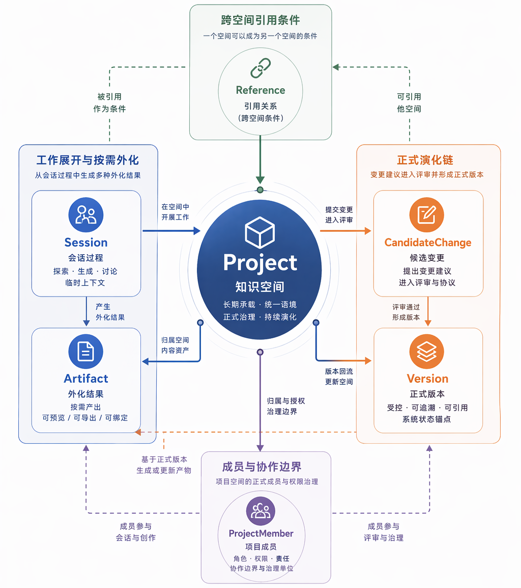
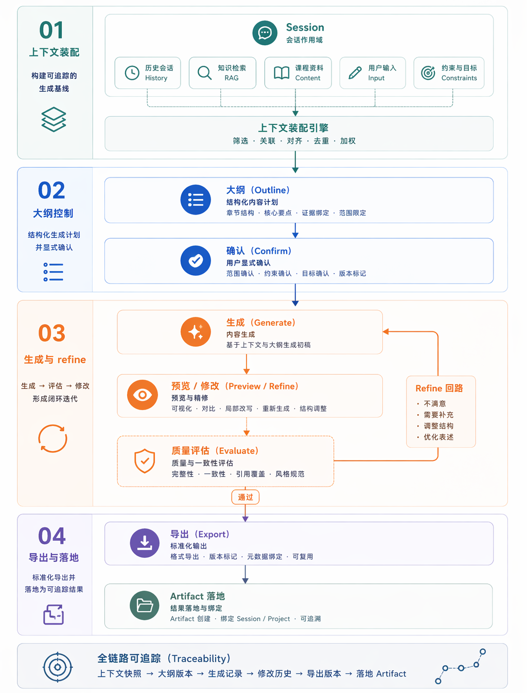

<!-- anchor: anchors/06-核心技术/01-内容生成.yaml -->

## 基于大模型的提示词工程与内容生成技术

内容生成链承担的任务，是把教师给出的教学目标、资料和修改意见转成可推进、可确认、可继续修改的会话过程。当前系统采用 `Session -> outline -> confirm -> generate -> refine` 的阶段链路，把“直接让模型一次性输出全部结果”的做法改写为可管理的生成过程。生成主链由 `Session` 状态推进承接，`Diego` 负责大纲与正式内容生成，后续预览、导出和结果保存再接入同一条结果链。

{width="6.0in" height="6.7in"}
图 6-1 生成主链相关示意图，说明生成过程中的关键阶段。

{width="6.0in" height="7.7in"}
图 6-2 会话驱动的生成阶段链示意图，说明上下文装配、outline、确认、生成、预览与导出如何被组织到同一条主链中。

当前实现可以从页面、接口和复核证据三个层面核对：

| 证据类型 | 当前对应 |
| --- | --- |
| 页面入口 | Studio 生成配置、卡片执行入口、结果预览页 |
| 接口契约 | `POST /api/v1/generate/sessions`、`POST /api/v1/generate/studio-cards/{card_id}/execution-preview`、`POST /api/v1/generate/studio-cards/{card_id}/execute` |
| 服务分工 | Spectra backend 承接会话编排与状态推进，`Diego` 承接大纲与正式生成，`Pagevra` 承接后续预览与导出 |
| 复核证据 | 会话创建约束测试、Studio card 执行映射测试、会话预览 contract 测试 |

这条链路至少包含四个关键环节：

- 意图收集：围绕会话记录教学目标、重难点和补充要求；
- 结构组织：先形成 `outline` 或中间结构，让用户能提前判断方向；
- 正式生成：在用户确认之后进入结果生成，而不是把确认和生成混成一步；
- 后续 refine：生成结果不是终点，还要支持继续修改和再次组织。

从实现角度看，提示词工程与会话状态、资料证据和卡片配置共同组成执行请求，再由 `outline`、确认和正式生成几个阶段逐步推进。`Session` 对应一次具体工作过程，既保存当前阶段，也约束下一步允许进入的动作；内容生成因此表现为有显式状态、有中间结构、可被用户打断和继续的流程。

接口契约也说明这条链是真实存在的。会话创建接口不再接受绕过 bootstrap 的直接启动路径；Studio card 执行接口把配置预览、正式执行和后续 refine 分成不同动作；预览 contract 又会把 `artifact_id`、`based_on_version_id` 和渲染结果一起返回。接口边界与页面行为一致，说明系统已经把“先组织输入、再执行生成、再接结果链”写进当前实现，而不只是停留在方案说明层。

从作品效果看，这项技术带来三点直接结果：

- 教师不需要在一开始写出过于复杂的完整指令；
- 生成流程可以在中间被确认和调整；
- 结果可以沿着 preview 和 refine 链继续修改，而不是一次性结束。

Studio 页面承担输入组织、卡片执行和结果承接三类任务；会话接口和阶段控制接口负责推进状态；预览页和结果页负责接住正式生成后的内容。页面、接口和生成链路能一一对应，这也是本节最直接的实现证据。

当前系统已经把内容生成组织成一条可管理、可复核的技术链。评审要核对这部分能力，可以同时看三处：Studio 页面是否存在明确的阶段推进，OpenAPI 是否保留了执行预览与正式执行的分离接口，以及主链测试是否证明生成结果能够继续进入预览、导出和保存流程。
