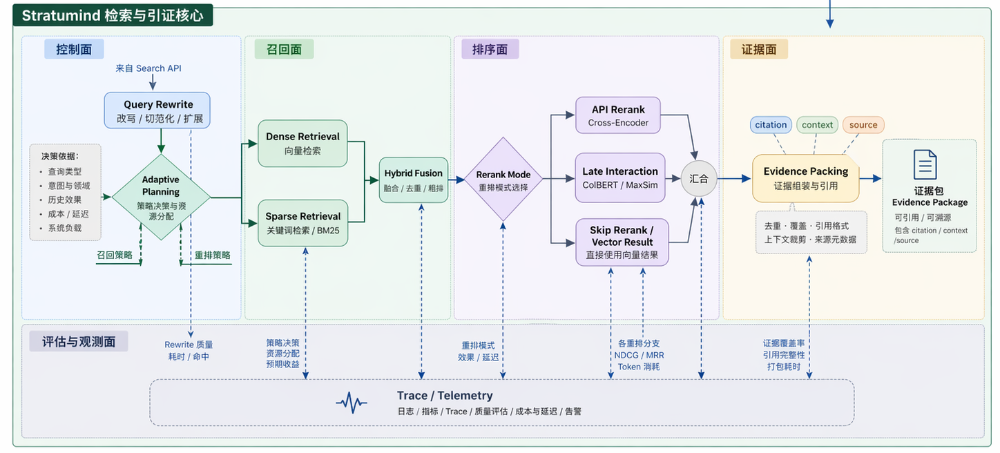

<!-- anchor: anchors/06-核心技术/02-知识库处理.yaml -->

## 知识库数据获取与处理技术

知识库处理链承担的任务，是把教师上传的资料转成可检索、可引用、可进入生成主链的证据集合。当前路径可概括为“资料进入 -> 解析与标准化 -> 切块 -> 向量化 -> 检索增强 -> 证据组织”。这条链路已经落到当前作品中的真实入口、真实服务边界和正式评估结果上。

{width="7.0in" height="3.2in"}
图 6-3 检索增强相关示意图，说明混合检索和证据组织在系统中的位置。

这部分能力目前可以从以下证据面核对：

| 证据类型 | 当前对应 |
| --- | --- |
| 页面入口 | 资料上传、来源查看、来源图片查看 |
| 接口契约 | `POST /api/v1/files`、`POST /api/v1/rag/index`、`POST /api/v1/rag/search`、`GET /api/v1/rag/sources/{chunk_id}` |
| 服务分工 | `Dualweave` 负责上传编排与远端解析入口，`Stratumind` 负责检索与向量召回，Spectra backend 负责查询组织、超时控制与响应整形 |
| 复核证据 | 远端解析衔接测试、RAG 指标计算与回归评估、正式评估集结果 |

当前知识库处理包含以下步骤：

- 资料进入：接收 PDF、Word、图片等资料；
- 解析与标准化：把可用内容从资料中提取出来；
- 切块与索引：把长文本整理成更适合召回和引用的知识块；
- 向量化与检索：支持后续相似内容召回；
- 证据组织：把检索结果进一步整理成更适合生成使用的内容。

在这条链路里，资料先经过上传编排与远端解析入口，解析结果再进入 Spectra 当前的切块、索引和检索流程。上传后的资料会进入后续检索主链，并继续参与来源查看、证据组织和生成上下文构建。

从工程实现角度看，这一流程已经形成稳定分工。资料上传接口接收文件并记录项目、会话和用途信息；远端解析入口负责把复杂格式转成可继续处理的内容；backend 负责切块、embedding 和检索请求组装；`Stratumind` 则承担正式检索与证据召回职责。文件上传索引测试也覆盖了 `pending_remote -> reconcile -> terminal` 的远端解析衔接逻辑，说明这条链路不是纸面设计。

这部分技术带来的直接效果是：

- 生成前能先找到更相关的内容；
- 结果更容易和已有资料对齐；
- 检索质量可以通过正式评估数据来说明。

Lewis 等关于 RAG 的研究给出了一条公开技术脉络：语言生成若要减少事实漂移，需要显式检索外部证据并让生成过程利用这些证据。Spectra 当前实现沿用这一基本思路，但证据不直接停留在“召回一些片段”，而是继续组织为更适合生成使用的上下文，并在页面上保留来源查看能力。

在向量检索与质量调优层面，Qdrant 官方的 Search Engineering 教程进一步提供了混合检索、检索质量评估和召回调优的公开工程方法。Spectra 当前检索链没有照搬其中某一个教程，而是在正式评估集、对比基线和证据组织上采用同样强调“可测、可比较、可复验”的工程思路。

正式评估结果说明这部分能力已经落到量化层。第 7 章的 60 题与 105 题正式集评估显示，`advanced` 链路在 `Hit@3`、`MRR@3`、`Evidence Hit`、`Evidence MRR` 和综合质量指标上都明显优于 `raw_dense_topk` 与 `dense_only` 基线。评估结论不只说明系统“能找到相关内容”，还说明检索结果更适合作为生成证据进入后续主链。

当前知识库处理技术已经形成“资料进入 - 内容标准化 - 检索增强 - 证据组织”的完整技术路径。评审若要核对这部分能力，可以同时看四处：文件上传接口是否存在、来源查看是否落到页面、远端解析与检索衔接测试是否存在、正式评估集是否给出了稳定量化结果。
