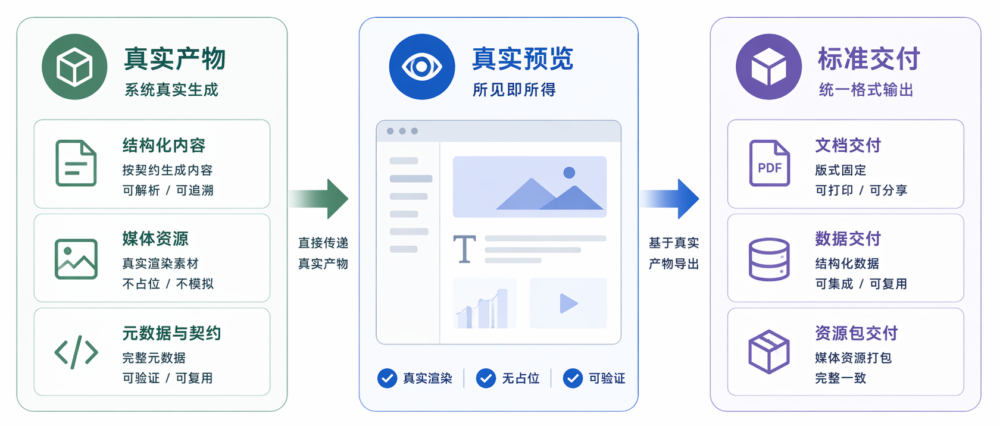

<!-- anchor: anchors/06-核心技术/03-渲染导出.yaml -->

## 结构化语义对象至多模态文档的高保真映射技术

该技术链承接正式生成结果的结构化渲染、细粒度预览、历史查看和多格式标准交付职责，实现成果对象从结构化语义状态向 `pptx`、`docx` 等多模态文档的高保真映射。当前系统将预览、历史查看和导出统一到同一成果链中，由 `Pagevra` 承接 preview / render / export authority，Spectra backend 承接会话状态、成果绑定和下载契约整形。

从评审理解角度看，本节重点说明两个方面：预览结果与交付结果是否保持一致，成果对象在展示、下载和后续修订之间是否保持统一语义。

{width="7.0in" height="3.0in"}
图 6-4 预览与导出相关示意图，说明结果如何进入 preview、history 和 download 流程。

该链路可从页面入口、接口契约、服务分工和工程验证路径四个层面核对：

| 工程验证路径 | 当前对应 |
| --- | --- |
| 页面入口 | 结果预览页、历史查看、导出与下载入口 |
| 接口契约 | `GET /api/v1/generate/sessions/{session_id}/preview`、`GET /api/v1/generate/sessions/{session_id}/preview/slides/{slide_id}`、`POST /api/v1/generate/sessions/{session_id}/preview/export` |
| 服务分工 | `Pagevra` 承接 preview / render / export，Spectra backend 承接 artifact 绑定、版本关联和下载响应 |
| 验证基准 | 预览 contract API 测试、preview schema 测试、artifact 渲染与结果绑定测试 |

从技术流程看，该链路承接四个稳定动作：

- 正式生成结果进入结构化渲染过程；
- 预览、历史查看和继续修订绑定到同一成果对象；
- 成果对象映射为标准文档格式并进入标准交付链；
- 交付后成果对象继续保持版本锚点与后续优化关系。

当前接口 contract 已将该链路固化到现有实现中。预览接口返回 `artifact_id`、`based_on_version_id`、`current_version_id` 和 `rendered_preview`；slide 级预览接口承接细粒度查看；导出接口承接当前成果对象向正式文件的映射和交付。工程验证路径直接检查成果对象锚点、版本关系和 `rendered_preview.pages` 的完整性，说明该链路具备接口级和对象级双重可核验性。

从工业级工程质量角度看，该技术链体现出三项关键特征：其一，预览结果与导出结果基于同一结构化成果对象构建，保证展示语义和交付语义的一致性；其二，预览、历史、下载和后续优化过程围绕同一成果对象推进，保证业务状态迁移的幂等性和可追溯性；其三，成果对象在导出后仍保持与项目空间和版本锚点的强一致性挂载，保证后续修订与复用链路的连续性。

当前作品在这部分已给出充分证据：页面上存在 preview、history 和 download 入口；接口层存在对应 contract；工程验证路径证明预览页返回真实渲染数据和成果对象绑定关系。该技术链的工程价值集中体现在结果展示、结果交付和结果管理三者之间的统一性，而不局限于单一文件格式转换。

综上，当前系统已形成结构化语义对象至多模态文档的高保真映射技术链。评审若需核对该能力，可直接检查三类事实：页面是否存在真实预览和历史查看入口，OpenAPI 是否提供完整 preview / export 契约，工程验证路径是否证明成果对象、版本锚点和渲染结果保持一致挂载。

本节可压缩为一句判断：系统已经将成果对象的展示、交付和持续管理统一为同一条高保真映射技术链。
