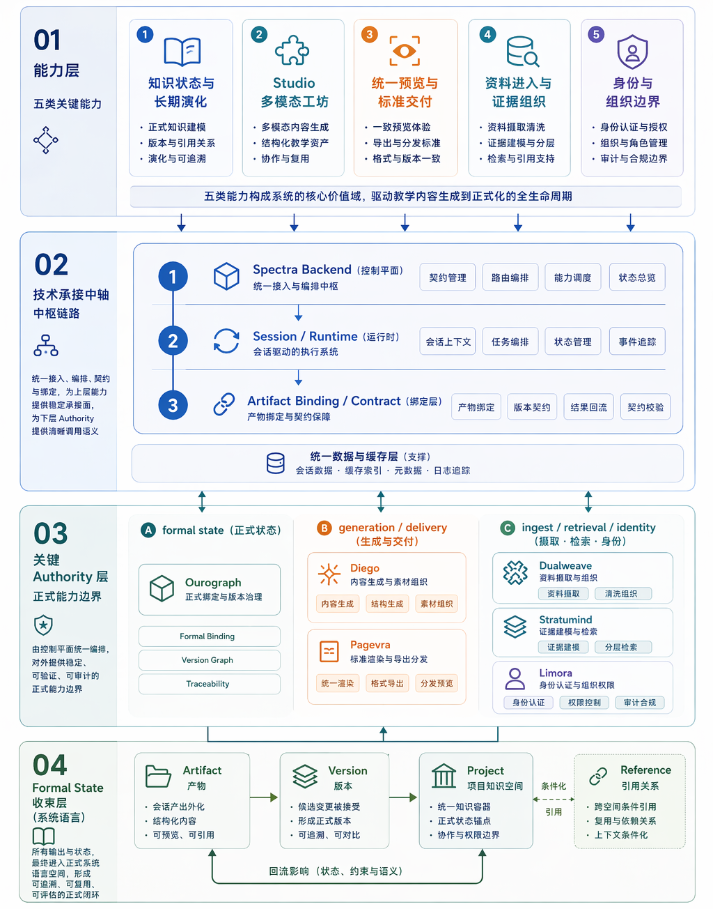
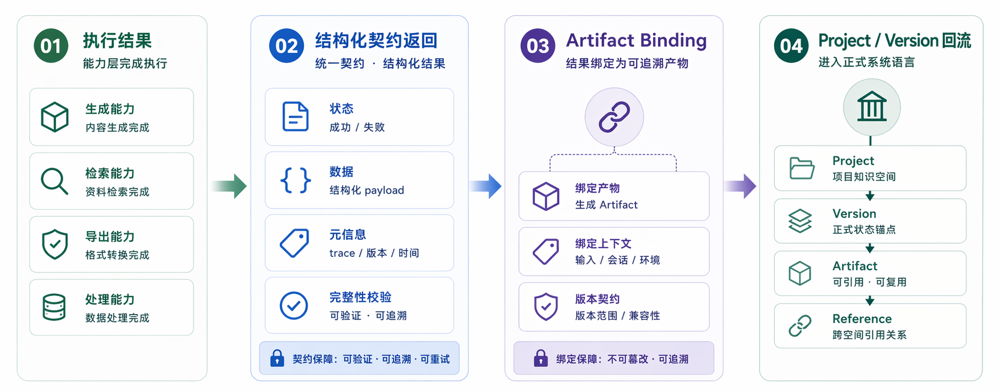
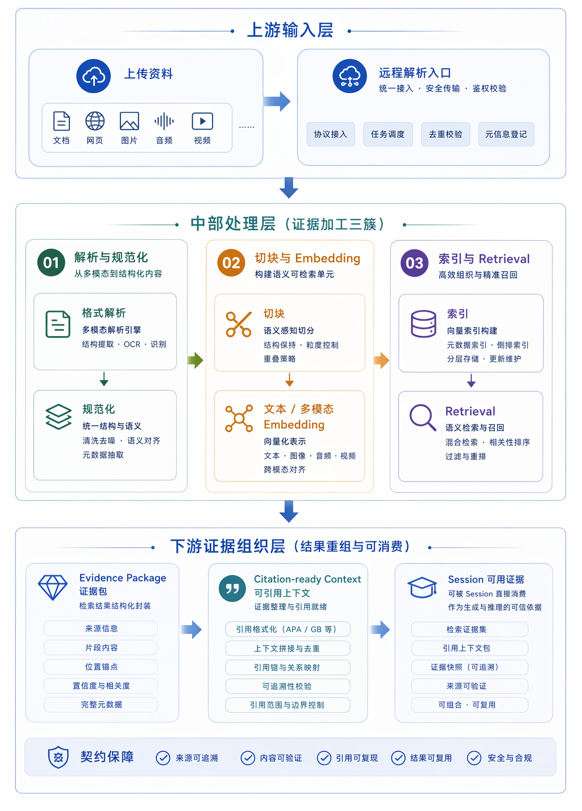
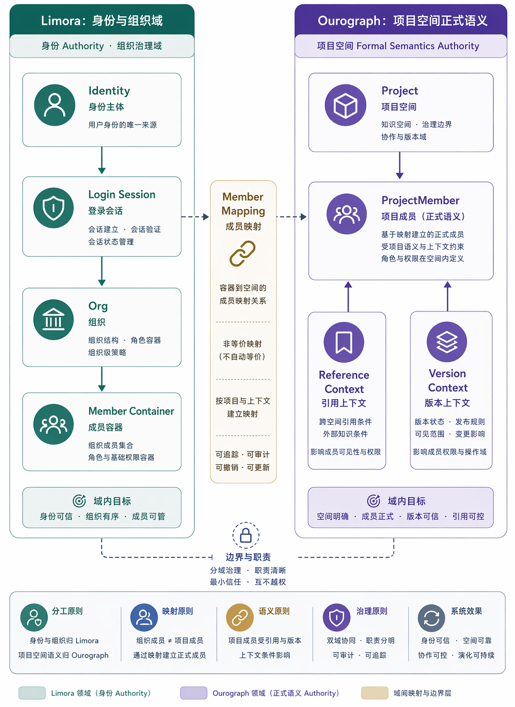
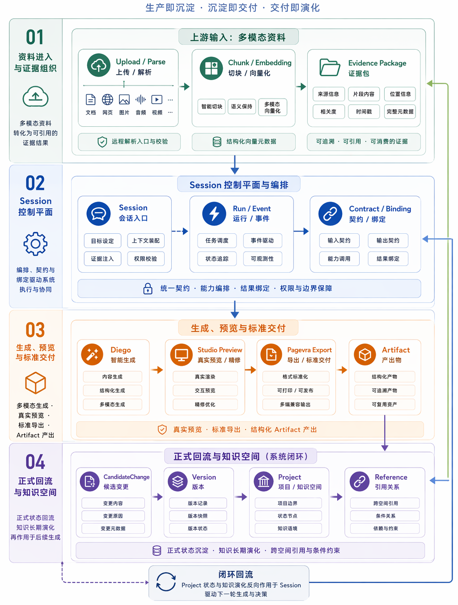

<!-- anchor: anchors/06-核心技术/04-状态与版本管理.yaml -->

## 知识空间状态与版本管理技术

该技术链承接成果对象的正式绑定、版本锚定、引用关系维护和成员边界治理职责，实现生成产物与项目空间的强一致性挂载。当前实现围绕 `Project`、`GenerationSession`、`Artifact`、`ProjectVersion`、`ProjectReference` 和 `ProjectMember` 等对象组织状态、版本、引用和成员边界，使成果对象具备保存、回看、替换、引用和持续复用能力。

从竞赛评审角度看，本节重点说明三个问题：成果对象如何进入项目空间，版本与引用关系如何保持稳定，权限与成员边界如何形成治理基础。

{width="6.0in" height="7.5in"}
图 6-5 结果状态与版本关系示意图，说明结果保存会进入可继续管理的状态。

{width="7.0in" height="3.0in"}
图 6-6 结果绑定与正式回流示意图，说明执行结果如何经结构化契约、Artifact 绑定与 Project / Version 回到项目空间。

{width="5.8in" height="7.6in"}
图 6-7 从解析到底层结果组织的能力分层示意图。

{width="5.6in" height="7.3in"}
图 6-8 用户、组织和结果边界示意图。

{width="5.9in" height="7.7in"}
图 6-9 核心模块围绕同一套资料与结果关系运行的示意图。

当前实现可从对象模型、接口契约、运行语义和服务边界四个层面核对：

| 工程验证路径 | 当前对应 |
| --- | --- |
| 对象模型 | Prisma 中明确存在 `Project`、`GenerationSession`、`Artifact`、`ProjectVersion`、`ProjectReference`、`ProjectMember` |
| 接口契约 | 预览与项目空间相关接口返回 `artifact_id`、`based_on_version_id`、`current_version_id` 等结果锚点 |
| 运行语义 | 结果创建、结果替换、正式记录复用、共享与引用权限均有 focused tests 覆盖 |
| 服务边界 | `Ourograph` 负责 formal state 语义，Spectra backend 负责消费、编排和绑定 |

从领域对象关系看，该技术链至少回答四项核心问题：

- `Project` 承接长期存在的课程项目或资料空间；
- `Session` 承接一次具体业务过程和中间状态推进；
- `Artifact / Version` 承接可保存、可回看、可比较的成果状态；
- `Reference / Member` 承接成果关系、引用关系和协作边界。

上述对象并非停留在概念层。Prisma schema 中已存在相应模型；成果对象相关 focused tests 会检查 `based_on_version_id` 绑定、替换模式下 `superseded_by_artifact_id` 回写，以及 Office 成果优先复用 authority artifact 的行为；项目语义测试与权限语义测试覆盖了共享、引用和成员权限边界。这说明状态与版本管理语义已经固化到当前数据模型和运行规则中。

在工程实现层面，该技术链体现出三项关键特征：其一，通过成果对象绑定和版本锚定机制保证业务状态迁移的原子性；其二，通过过程态与结果态分层设计保证短期状态不会覆盖长期成果状态，维持数据一致性；其三，通过引用关系与成员边界治理机制保证成果对象在协作场景中的可追溯性和权限可解释性。

成员边界和登录会话由 `Limora` 承接，其认证实现依托 Better Auth 的会话与组织边界能力。当前项目空间、成员关系和成果对象权限共用同一套身份语义，使页面、项目空间和成果归属在权限口径上保持一致。该设计为后续组织级扩展提供了稳定的身份与边界控制基础。

图 6-6 进一步说明了成果回流契约。执行结果先形成统一状态与结构化 payload，再通过 `Artifact` 绑定获得可追溯身份，随后进入 `Project / Version` 关系，成为后续查看、替换、引用和比较的基础。该流程使生成结果由瞬时执行结果转化为项目空间中的正式语义对象。

综上，当前系统已形成围绕知识空间的状态与版本管理技术链。评审若需核对该能力，可直接检查四类事实：Prisma 是否存在对应领域模型，预览接口是否返回稳定的版本锚点，focused tests 是否覆盖成果对象与引用语义，服务边界是否明确区分 formal state authority 与业务编排职责。

本节可归纳为一句判断：系统已围绕成果对象形成具备原子性、可追溯性和可治理性的状态与版本管理基础。
