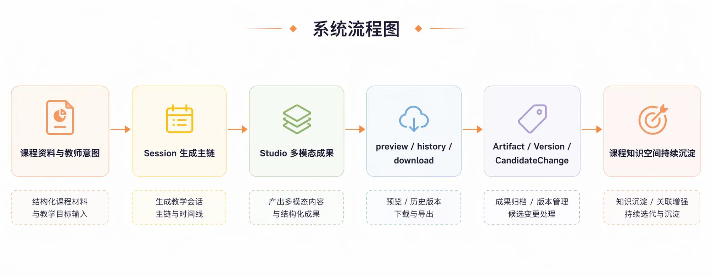

<!-- anchor: anchors/07-项目测试与成果展示/01-界面与成果展示.yaml -->

## 前端界面操作与成果展示

从当前作品展示看，系统已经形成统一工作台，并支持围绕同一套资料产出多种结果，包括课件、文档、导图、互动内容和辅助材料。用户在作品中可以看到哪些页面、完成哪些操作、得到哪些结果，都能够直接对应到当前工作流程。不同结果围绕同一套资料和同一次工作过程被统一组织起来。

{width="7.0in" height="2.7in"}
图 7-1 当前界面与成果截图

结合界面与流程，当前能明确看到的成果主要有：

- 统一工作台入口；
- 会话推进与生成流程；
- 预览、修改、下载等结果操作；
- 多种成果输出形式。

按用户操作链看，当前界面已经能够支撑一条完整使用过程：

1. 进入工作台，围绕当前项目查看资料、对话和结果；
2. 通过会话或工具入口推进生成；
3. 在生成后进入预览界面查看结果；
4. 继续执行修改、历史查看和下载等操作；
5. 将结果继续纳入后续使用流程。

从使用场景继续拆分，当前成果可以理解为一个“多种结果矩阵”：

| 成果类型 | 当前状态 | 在作品中的体现 |
| --- | --- | --- |
| PPT / 课件 | 已进入生成流程 | 支持从 `outline` 到生成、预览、导出的完整流程 |
| Word 教案 / 教学文档 | 已进入统一工作台 | 支持真实结果查看与下载 |
| 思维导图 | 已进入成果矩阵 | 用于梳理知识结构和章节关系 |
| 互动小测 / 互动内容 | 已进入成果矩阵 | 用于课堂练习和反馈场景 |
| 说课助手 / 学情预演 | 已进入成果矩阵 | 用于辅助教师表达和课前准备 |

这些成果已经能在同一工作台里被统一组织。用户进入系统后，在同一工作流程中完成资料进入、生成推进、结果查看、修改和下载。界面层面能够维持这种连续性，本身就是作品完成度的重要证据。

系统设计和核心技术最终仍需要回到作品里“能看到什么”。当前界面与成果展示证明了三点：

- 用户确实能在统一工作台中推进一次完整操作；
- 结果确实能以多种形式被展示出来；
- 这些结果和后续预览、修改、下载动作之间已经建立了清楚联系。

当前界面展示对应三类已经被产品化组织起来的动作：资料与会话输入、生成与修改、预览历史查看与下载。这三类动作在界面中都能找到明确落点，也正对应第 5 章的系统设计和第 6 章的技术流程。

若结合当前 execution plan 和主链验证材料继续判断，界面层最稳定跑通的仍然是 `PPT` 主链：从 `outline`、确认、正式生成，到 preview、history 和 download 的承接关系都更完整。Studio 卡片层则表现为“主链已打通 + 多卡片分层成熟”的状态：不同卡片都已进入统一目录和统一协议，但 `refine`、`turn`、`placement` 的成熟度并不相同，因此送审稿不宜把八张卡片统一写成同等完成度。

当前界面还有一个重要特征，即结果展示不依赖临时占位。用户在 preview、history 和 download 中看到的内容，均对应真实结果保存与导出流程，而不是临时拼接的页面素材。这一点使界面展示和交付结果之间保持一致，也为后续核心业务流程稳定性测试提供了页面层面的证据。

界面展示说明，系统能够把不同结果统一放回同一工作台里继续查看、修改和复用。
