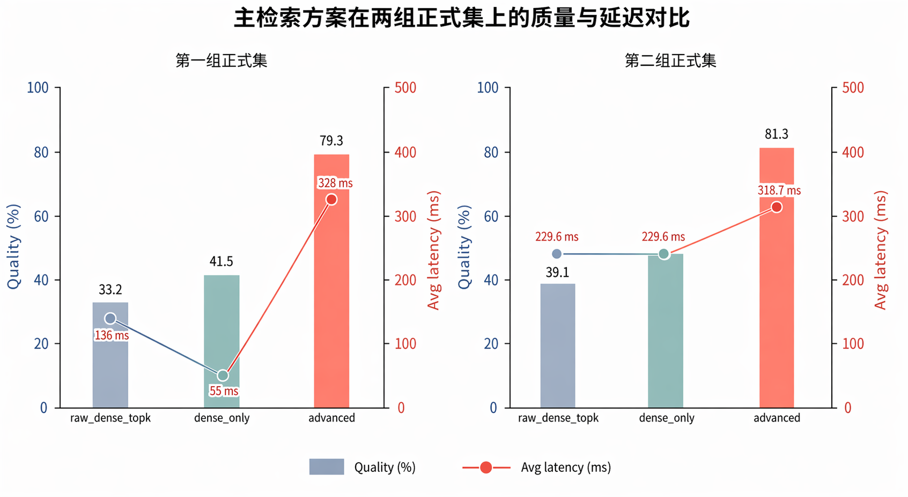
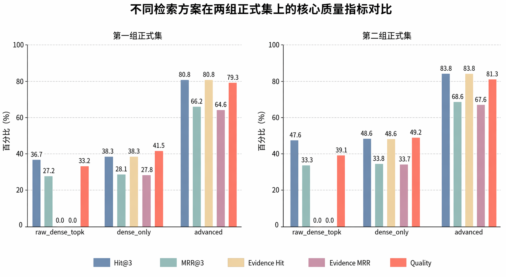
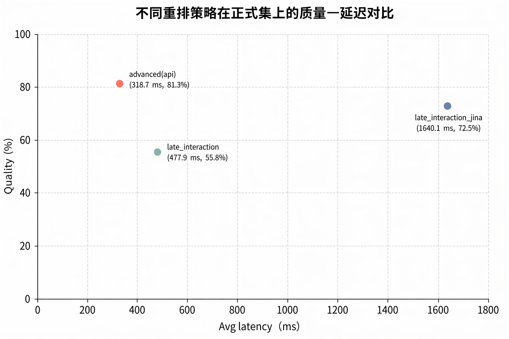

<!-- anchor: anchors/07-项目测试与成果展示/02-检索评估.yaml -->

## 系统检索质量评估测试

检索质量部分提供了最直接的量化证据之一。正式评估结果显示，`advanced` 流程相较 `raw_dense_topk` 与 `dense_only` 基线有稳定提升。结论来自统一评估口径、正式测试集和明确指标。

评估口径主要关注三类问题：

- 能不能在前几条结果里命中相关内容；
- 命中的内容是否排在更靠前的位置；
- 命中的结果能不能真正支撑后续生成，而不是只“像相关”。

为避免证据类型混杂，本节只回答检索质量问题，不把核心流程生成、预览或导出结果并入同一张表。当前采用的指标包括 `Hit@3`、`MRR@3`、`Evidence Hit`、`Evidence MRR`、`Quality` 和平均延迟。其中，`Evidence Hit` 与 `Evidence MRR` 直接对应“召回结果是否足以进入后续生成”这一问题。

当前对比方案的含义如下：

| 对比方案 | 当前含义 |
| --- | --- |
| `raw_dense_topk` | 仅保留基础 dense 召回结果，不做 sparse 召回、重排和证据组织 |
| `dense_only` | 保留当前 dense 检索主路径与基础结果整形，但关闭 sparse 混合、query fusion 与正式 rerank |
| `advanced` | 使用当前正式检索增强方案，包含 query rewriting、adaptive planning、dense + lexical hybrid、可选 query fusion、API rerank、evidence packing 与结果整形 |

这三组方案的区别，不能只理解为“算法名不同”，而要理解为“链路层数不同”。`raw_dense_topk` 更像最基础的向量召回基线；`dense_only` 已经保留了当前系统的一部分工程组织，但仍然不引入 lexical 混合和正式重排；`advanced` 则是当前生产默认想回答的问题：在中文课程资料、OCR 风格文本和证据引用要求并存的前提下，哪一条完整检索链更适合进入后续生成。

### 60 题正式集结果

| 对比方案 | Hit@3 | MRR@3 | Evidence Hit | Evidence MRR | Quality | Avg latency |
| --- | --- | --- | --- | --- | --- | --- |
| `raw_dense_topk` | 36.7% | 27.2% | 0.0% | 0.0% | 33.2% | 136 ms |
| `dense_only` | 38.3% | 28.1% | 38.3% | 27.8% | 41.5% | 55 ms |
| `advanced` | 80.8% | 66.2% | 80.8% | 64.6% | 79.3% | 328 ms |

从这组数据看，`advanced` 相比 `dense_only` 在命中率、排序质量和综合质量上同步提升。尤其是 `Evidence Hit` 和 `Evidence MRR` 的变化，说明系统拿到的不只是“看起来相关的段落”，而是更适合进入后续生成和引用组织的证据结果。这里提升的不只是召回数量，更是证据可用性。

{width="7.0in" height="3.8in"}
图 7-2 60 题正式集质量与延迟对比图

### 105 题正式集结果

| 对比方案 | Hit@3 | MRR@3 | Evidence Hit | Evidence MRR | Quality | Avg latency |
| --- | --- | --- | --- | --- | --- | --- |
| `raw_dense_topk` | 47.6% | 33.3% | 0.0% | 0.0% | 39.1% | 229.6 ms |
| `dense_only` | 48.6% | 33.8% | 48.6% | 33.7% | 49.2% | 229.6 ms |
| `advanced` | 83.8% | 68.6% | 83.8% | 67.6% | 81.3% | 318.7 ms |

这组更大规模的正式集结果显示，系统在数据规模扩大后仍保持稳定提升趋势，检索增强不是只在少量样本上偶然有效。正式集规模扩大后，`advanced` 流程仍保持较高的命中率与排序质量，说明当前这条 `dense + lexical hybrid + rerank + evidence` 链具备较稳定的重复验证结果。

{width="7.0in" height="3.8in"}
图 7-3 两组正式集核心指标对比图

### 补充比较：重排策略测试

除正式主表外，项目还在 105 题正式集上补做了重排策略比较，用于观察不同方法在当前数据条件下的实际表现。该组比较不替代前述正式主结论，只用于说明团队对检索方法做过进一步比对，而不是只停留在单一方案上。

为避免方案名称本身造成理解门槛，这里先说明三种方案在本轮比较中的含义：

| 对比方案 | 当前含义 |
| --- | --- |
| `advanced(api)` | 当前正式采用的检索增强方案。前面仍是 query rewriting + adaptive planning + dense/sparse hybrid，候选结果再进入 `Dualweave /rerank/text`，由 DashScope `qwen3-rerank` 完成文本重排，最后进入 evidence packing 与结果整形。 |
| `late_interaction` | 保留前面的 hybrid 候选召回，但把 rerank 后端切换为 `Stratumind` 的 late-interaction sidecar，对候选结果做 ColBERT 风格 token 级重排。本轮补充比较采用默认小模型 `answerdotai/answerai-colbert-small-v1`。 |
| `late_interaction_jina` | 仍使用同一套 late-interaction sidecar，只把模型切换为 `jinaai/jina-colbert-v2`，用于观察更强多语言模型在当前数据集上的质量与延迟变化。 |

| 对比方案 | Hit@3 | MRR@3 | Evidence Hit | Evidence MRR | Quality | Avg latency |
| --- | --- | --- | --- | --- | --- | --- |
| `advanced(api)` | 83.8% | 68.6% | 83.8% | 67.6% | 81.3% | 318.7 ms |
| `late_interaction` | 54.3% | 40.3% | 54.3% | 40.2% | 55.8% | 477.9 ms |
| `late_interaction_jina` | 75.2% | 54.0% | 75.2% | 53.2% | 72.5% | 1640.1 ms |

这组补充结果说明，`advanced(api)` 在当前正式集上的综合表现仍然更稳。`late_interaction` 相关方案并非没有测试，而是在本轮数据形态、参数设置和工程约束下，尚未体现出优于 `advanced(api)` 的综合效果。更稳妥的结论是：这类方案后续仍有继续优化和复核空间，但在当前中文课程资料、OCR 风格文本与延迟约束条件下，基于 DashScope `qwen3-rerank` 的 API rerank 路径，在质量与响应时间之间取得了更合适的平衡。

{width="7.0in" height="4.2in"}
图 7-4 不同重排策略质量与延迟对比图

### 检索测试结论

结合两组正式集，可以得到三个更稳妥的结论：

1. 当前检索流程已经明显优于基础 dense 检索；
2. 系统不仅“能命中内容”，还更容易给出可支撑生成的证据；
3. 这部分能力已经有量化数据支撑，能够作为作品中的硬证据使用。

两组正式集结果说明三点。第一，`advanced` 流程在命中率、排序质量和综合质量上同时提升。第二，这些提升在更大规模正式集上仍保持稳定。第三，`Evidence Hit` 和 `Evidence MRR` 的提升更直接反映“当前 `dense + lexical hybrid + rerank + evidence` 链是否真正支撑后续生成”，而不只是把相似段落排在前面。

第 6 章的知识库处理技术对应资料如何进入、切块和组织，第 5 章的数据处理流程对应证据如何进入生成流程，本节则用量化数据说明这一流程已经进入当前实现。检索增强如果没有效果，后续生成很难稳定地与项目资料对齐；当前评估结果则证明这部分已经形成可测、可重复验证的能力。

检索质量评估用于说明资料和证据支撑的可靠性；下一节的核心业务流程稳定性验证用于说明生成、预览、导出和保存流程的连续可用性。两类证据分别回答不同问题，不混在同一张表中解释。
