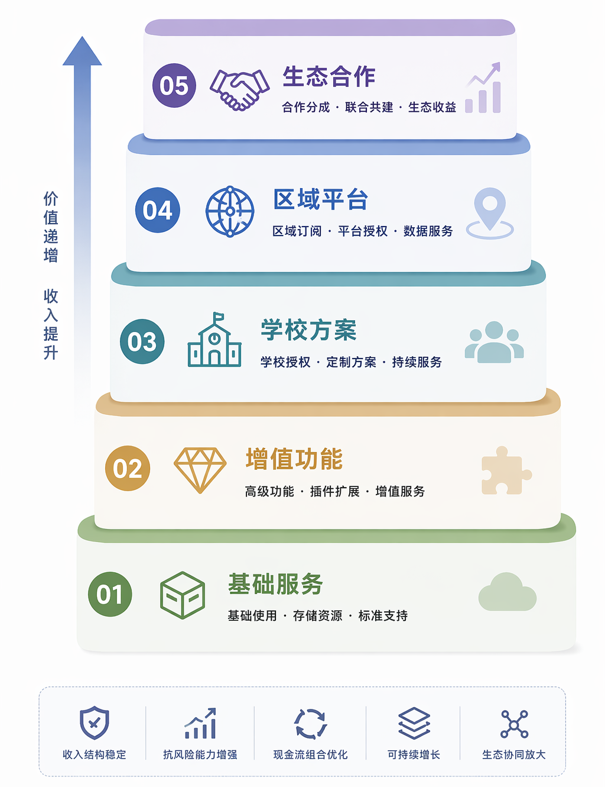

## 推广策略

本节重点说明系统应按何种顺序推进应用验证，以及当前章节适合给出哪些结论，不适合提前给出哪些结论。

### 推广原则

当前更适合采用由轻到重的推进路径。推广应围绕高频场景展开。推广应围绕已完成的模块和已验证的主链展开。这样可以控制验证成本，也有助于保持结论稳健。

从当前作品完成度看，推广的重点应放在应用验证和样本积累上。相关表述宜保持克制。现阶段更适合强调“具备持续验证条件”和“具备进一步推广基础”，不宜直接写成大规模落地结论。

### 分阶段推进路径

1. 第一阶段，面向个人教师和小团队开展验证。此阶段重点观察统一工作台是否减少资料整理、界面切换和结果导出的时间成本，重点观察生成主链是否能够稳定支撑备课与课程准备。
2. 第二阶段，面向课程团队和教研协作场景扩展。此阶段重点观察共享资料、统一成果管理、版本记录和结果回看是否支持协同迭代，重点验证多应用对象围绕同一项目持续工作的可行性。
3. 第三阶段，面向需要沉淀课程资源的组织场景推进。此阶段重点观察成果保存、引用关系、成员协作和长期留存机制是否支持更大范围使用，同时结合部署条件和治理要求进行审慎扩展。

{width="7.0in" height="2.8in"}
图 9-2 推广路径示意图，说明系统从个人使用到团队协作再到组织场景扩展的推进顺序。

### 推广依据

这一推进路径与现有系统结构保持一致。第 5 章已经说明资料接入、生成推进、结果查看和导出保存等主链模块。第 7 章已经提供界面展示、检索评估和主链稳定性测试证据。因此，推广策略建立在现有功能模块和验证结果之上。

从交付价值看，第一阶段更容易形成直接证据。页面流程、结果样本和测试统计都可以较快说明系统是否有效缓解了重复整理和多工具切换问题。第二阶段和第三阶段则需要更多协同样本、更多运行周期和更完整的组织条件支撑。因此，分阶段推进更符合当前作品的成熟度。

### 推广边界

当前章节适合写入的结论包括三点：

1. 系统已具备应用验证基础。
2. 系统已具备继续推广条件。
3. 系统能够支撑个人、团队和组织场景的进一步验证。

{width="4.0in" height="5.2in"}
图 9-1 商业推进层次示意图，可作为应用验证、结果复用与组织场景扩展三层关系的辅助说明。

当前章节不宜提前写成“已形成稳定商业闭环”或“已完成大规模机构落地”等结论，因为这些判断仍需更多样本和更长周期支持。

这种边界处理有助于提高稿件可信度。评审可以清楚区分“已经完成的系统能力”和“仍需继续验证的应用条件”。

综上所述，本节可以形成如下判断：`Spectra` 当前更适合按“个人场景验证、团队协作扩展、组织场景推进”的顺序逐步扩大应用范围，并以持续样本和运行证据支撑后续推广结论。
